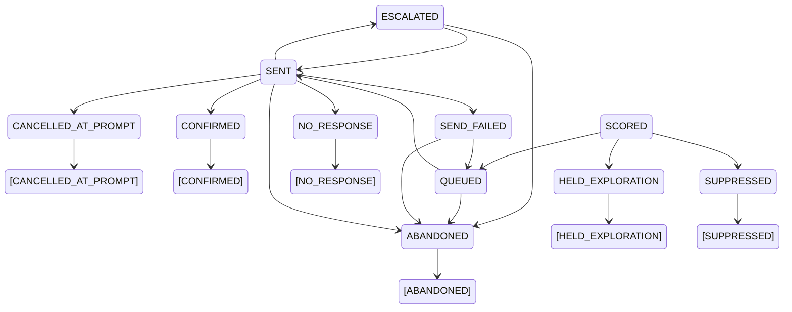

# ARCHITECTURE.md

**COD Return-to-Origin Risk Detector**
Razorpay AI Buildathon — Track 02, AI Risk Manager
Class of loss: **COD return-to-origin (RTO)**. One loss, closed loop.

---

## 0. Status legend

Every component in this document carries one of five tags. Nothing is ambiguous about
what was measured and what was designed.

| Tag | Meaning |
|---|---|
| **[BUILT]** | Implemented, evaluated on observed outcomes, numbers in the metrics tables |
| **[BUILT-UNEVAL]** | Implemented, unit-tested, but **cannot be evaluated on available data**. Ships inert. No numbers reported. |
| **[BUILT-NOT-SHIPPED]** | Implemented, tested, **evaluated — and rejected by that evaluation**. Runs, passes every gate, is not in the model. Reachable only by name. |
| **[DESIGN]** | Specified here, not implemented. Named in Limitations. |
| **[DEFERRED]** | Considered and dropped. Reason recorded in §15. |

The difference between the second and third is the whole point of having both.
`[BUILT-UNEVAL]` means the data could not answer the question. `[BUILT-NOT-SHIPPED]`
means it did, and the answer was no.

The single most important property of this repo is that a reader can tell which tag
applies to any number they see.

### REALIZED STATUS — the authoritative table

This document was written before the code existed, so several tags below were
aspirational. This table is the corrected one; where an inline tag elsewhere in the
document disagrees with this table, **this table is right**.

**Every metric in this repo comes from `[BUILT]` components on observed Olist outcomes.**
No number anywhere derives from a `[DESIGN]` or `[DEFERRED]` component, because none of
them run — and none derives from the `[BUILT-NOT-SHIPPED]` group either, apart from
`eval/feature_expansion.md`, which is the report on why it does not ship. That sentence
governs all three tables below, which is why it sits above them.

#### Shipped and measured — `[BUILT]`

Everything a reported number comes from.

| Component | Tag as written | Where |
|---|---|---|
| Olist loader, maturation, labels, splits | [BUILT] | `data/loader.py` |
| Point-in-time feature builder | [BUILT] | `features/builder.py`, `eval/feature_report.md` |
| Order / customer / pincode / availability features | [BUILT] | 35 columns, §4.1 |
| LightGBM + monotonic constraints | [BUILT] | `eval/model_report.md` |
| Platt calibration + reliability | [BUILT] | `eval/calibration.md` |
| Cross-fitted calibration-window comparison | not written | `eval/calibration.md` §2, `tests/test_calibration_folds.py` |
| Chance-comparison calibration study | not written | `eval/significance.md` §2 — false-positive rate of the two chance tests |
| Per-order cost model, Elkan, action ladder | [BUILT] | `eval/policy.md` |
| TreeSHAP + risk reasons | [BUILT] | `eval/reasons.md` |
| FastAPI scoring endpoint + single-page UI + Dockerfile | [BUILT] | `api/`, `ui/app.py`, `docs/API.md`; serve the UI with `uvicorn ui.app:app --port 8001` |
| Fairness tables by region tier | P1 | `eval/fairness.md` — on a derived proxy, see below |
| Tier-1 lock + capture | not written | `eval/TIER1_LOCK.json`, `scripts/90_capture_tier1_lock.py` |

#### Built, evaluated and rejected — `[BUILT-NOT-SHIPPED]`

**ΔAP −0.0028, 95% CI [−0.0180, +0.0027] — which includes zero, and the decision rule was
fixed before the run.**

| Component | Tag as written | Where |
|---|---|---|
| Seller / route / parcel-structure / density features | not written | 19 columns — `eval/feature_expansion.md` |

`[BUILT-NOT-SHIPPED]` is a fifth tag and it means what it says. These groups exist, run,
and pass every gate the shipped features pass — point-in-time truncation-invariance,
carrier-date perturbation, the join-cardinality audit, whitelist enforcement, constraint
alignment, and byte-exact store parity. They are not in the model. `FeatureBuilder()`
builds `DEFAULT_GROUPS`, which excludes them; they are reachable only by naming them.

**The distinction from `[DESIGN]` is total**: this code runs and is tested, it simply did
not earn a place in the model. That is why it has its own table rather than a footnote in
either of the others.

#### Specified, not built — `[DESIGN]` and `[DEFERRED]`

No code. Nothing here ships inert, and nothing here produces a number.

| Component | Tag as written | Actual | Where |
|---|---|---|---|
| Address regex/vocab block | [BUILT-UNEVAL] | **[DESIGN]** | not written — §15 |
| Network / ring layer | [BUILT-UNEVAL] | **[DESIGN]** | not written — §15 |
| Tier-2 semi-synthetic uplift layer (ξ) | [BUILT, separately reported] | **[DESIGN]** | not written — §15 |
| Tier-3 synthetic demo generator | [BUILT-UNEVAL, fenced] | **[DESIGN]** | not written — §15 |
| `/demo` checkout simulator | step 7b | **[DESIGN]** | not written — §15 |
| Bounded auto-responder | out of scope (§1) | **[DEFERRED]** | §15 |
| Interventional TreeSHAP | [BUILT] (§8) | **[DEFERRED]** | §8, §15 |
| LightGBM/TabPFN router, EBM, CAAFE, Splink, … | [DEFERRED] | **[DEFERRED]** | §15 |

**The address and ring extractors are the important correction.** §4.2 and §4.6 describe
them as implemented, unit-tested and exercised by a demo harness. **None of that exists.**
They were never written. The `[BUILT-UNEVAL]` tag would have told a reader that code
shipped inert; the truth is that no code shipped at all. Since the whole point of §0 is
that a reader can trust the tag, an inaccurate tag is worse than a missing feature.

---

## 1. The loss, and the system

A COD order is placed. The parcel ships. The customer refuses at the door, is
unreachable, or the address is undeliverable. The parcel comes back. The merchant pays
forward shipping, reverse shipping, handling, and carries blocked inventory for the
round trip — and collects nothing.

**System:** a calibrated pre-shipment risk scorer, evaluated on a held-out time-based
split, coupled to a bounded auto-responder selected by an expected-cost policy.

**Scope of this document:** the detector and the policy layer that selects an action
tier. The auto-responder's internal design (message state machine, stopping rules,
retry/idempotency, audit log) is specified separately once the detector's numbers exist.
This document defines the *interface* the responder consumes — tier, calibrated
probability, risk reasons — and nothing downstream of it.

### 1.1 The pipeline, end to end

One canonical diagram. Everything in this document is a component of it. `[U]` marks
components that ship inert on Olist (§4.2) and produce no reported metric.

The reason mapping is drawn as its own stage rather than folded into the output line. It
is a designed component — an attribution space, a grouping rule, and a template set, each
of which could have been chosen differently — and the diagram should show that it was
built rather than implying the strings fall out of the model.

```
INPUT: order at checkout  (Razorpay-shaped payload, §11.1)
   │
FEATURES  (production contract; Olist populates a subset, §4)
   ├─ order fields ....... value, category, freight ratio, COD flag, timing
   ├─ customer history ... point-in-time expanding windows only (§4.3)
   ├─ pincode ............ smoothed target encoding + pgeocode consistency/geo
   ├─ address regex+vocab  [U]  12 features, no parser, no model
   ├─ device / network ... [U]  normalise → degree-cap → rapidfuzz → union-find
   └─ availability ....... n_missing_features, has_* flags
   │
MODEL
   └─ LightGBM · natural class distribution, no resampling
                · monotonic constraints (§5.3)
                · regularised for ~1% prevalence (§5.2)
      [router → TabPFN cold-start branch: DEFERRED, §5.4]
   │
CALIBRATION
   └─ Platt (2-param) on temporal validation window
      → uniform-mass binning of the fitted function's outputs
      → calibrated P(failure) on a common scale
   │
POLICY  (§7)
   ├─ cost: impression + triggered, per order, per tier
   ├─ effectiveness: f(risk_reason, tier), swept
   ├─ Elkan threshold  p*(o) = c_FP(o) / (c_FP(o) + c_FN(o)),  per order
   └─ → allow / confirm / prepaid-only / defer
      + 2% randomized exploration slice   [DESIGN only, §7.7]
   │
REASON MAPPING  (§8)
   └─ TreeSHAP attribution (tree_path_dependent, exact for this model)
      → per-feature contributions in raw log-odds margin space
      → dominant feature GROUP per order, by summed positive attribution
      → templated merchant-facing string per group, top 3
      · monotone constraints (§5.3) are what make these strings safe to show
   │
OUTPUT: tier · calibrated p · top-3 SHAP risk reasons · model version
   │
   └─→ bounded auto-responder   (interface fixed here; internals out of scope, §1)
```

### Track alignment

| Track bar | Where it is met |
|---|---|
| Working detector for one class of loss | §5, §11 |
| Measured precision and recall on held-out test set | §9, chronological split |
| Honest metrics **including false-positive cost** | §7, four-row cost table + decision curve |
| Strictly defense-only | No component generates, evades, or probes. §12. |

---

## 2. THE GATE — run this before writing any other code

**This is the first commit. Everything downstream depends on the number it produces.**

Stack the filters in order and count what survives:

```
99,441 Olist orders
  → label = order fails to reach `delivered`         ~2,963  (~3.0%)
  → drop immature orders (§3.5 maturation window)    ~1,234  (canceled + unavailable)
  → restrict to boleto subset (COD analog, ~20%)     ~  240
  → temporal test split (most recent ~20%)           ~   50  positives in test
```

Those figures are estimates from the published Olist status distribution. **Compute the
real ones.** Write `scripts/00_count_positives.py`, print the table, commit the output
to `eval/positive_counts.md`.

### REALIZED — computed, not estimated

Gate run: `eval/positive_counts.md`. Targets declared in `eval/label_targets.md`.

```
99,441 Olist orders                                    (estimate 99,441  ✓)
  → label = order fails to reach `delivered`     2,963 (estimate ~2,963  ✓)
  → drop immature orders (§3.5)                  2,955 (estimate ~1,234  ✗ +1,721)
  → restrict to boleto subset                      593 (estimate ~  240  ✗   +353)
  → temporal test split (most recent 20%)           61 (estimate ~   50  ✗    +11)
```

**Maturation removes 8 orders, not the ~1,700 the estimate implied.** The estimate
assumed the filter would strip `shipped` / `invoiced` / `processing` and leave only
`canceled` + `unavailable`. Those statuses span 2016-09 to 2018-09 rather than banking
against the cutoff — a `shipped` order purchased in 2016 and still undelivered at a 2018
snapshot is mature and genuinely unresolved, not immature. The filter is correct; the
estimate's mechanism was wrong. All 8 dropped orders are `canceled` and none shipped.

**Boleto is secondary.** 61 boleto test positives puts the decision rule in the 50–150
band: all-orders is the primary *population*. Within it, the primary *target* is label (b)
on the risk set (§3.6).

| | PRIMARY | SECONDARY |
|---|---|---|
| Target | label (b), entered fulfillment & never delivered | label (a), any non-delivered |
| Population | risk set (shipped) | all matured orders |
| Estimand | **P(fails \| ships)** | P(fails) |
| Test positives | **154** | 379 |
| Test prevalence | **0.783%** | 1.906% |
| Minimum detectable PR-AUC difference | **0.043** | 0.027 |

MDD is quoted at AP = 0.10, paired at ρ = 0.8, α = 0.05 two-sided, power = 0.80. The
primary target needs a **1.57× larger** gap to resolve than the secondary. That is the
price of measuring the right quantity, and it is paid deliberately.

### Decision rule driven by that count

| Test positives | Action |
|---|---|
| ≥ 150 | Boleto subset is the **primary** analysis. All-orders reported alongside as the larger-sample view. |
| 50–150 | All-orders is **primary**. Boleto is a clearly-labelled **secondary** analysis with the small-n caveat stated in the table caption. |
| < 50 | Boleto appears in Limitations only. Do not build a metrics table on it. |

### The consequence nobody plans for

At ~50 test positives, PR-AUC confidence intervals are wide enough that **almost no model
comparison resolves**. TabPFN vs LightGBM, EBM vs LightGBM, `scale_pos_weight` on vs off,
monotonic constraints on vs off — all of them land inside each other's intervals.

Eight tables of overlapping intervals reads as padding. Two decisive numbers read as
judgement. §9 is trimmed on exactly this basis.

Compute the **minimum detectable PR-AUC difference** at your realised test size and print
it at the top of the evaluation section. Any comparison below that threshold is reported
as "not resolvable at this sample size," not as a win or a loss.

---

## 3. Data plan

Three tiers, labelled honestly in both README and every figure caption.

### 3.1 Tier 1 — real labels, real outcomes **[BUILT]**

**Olist Brazilian E-Commerce** (Kaggle). ~100k orders with actual delivery status
including `canceled` and `unavailable`, customer geolocation, order timestamps, payment
type, product category, price/freight split, review scores.

Target: order fails to reach `delivered`.

**This is not RTO.** It is a genuine observed delivery/fulfilment failure. All headline
precision and recall come from here, and the proxy status is stated plainly wherever a
number appears.

### 3.2 Tier 2 — semi-synthetic intervention layer **[DESIGN — not built]**

Real Olist covariates. Simulated intervention assignment and response **only**. Not
invented orders — real orders with a simulated response to a hypothetical intervention.

This follows accepted uplift-evaluation methodology: real-world uplift datasets lack
counterfactual ground truth, which makes direct validation of evaluation metrics
infeasible; a semi-synthetic approach retains real-world feature dependencies while
providing the ground truth needed to isolate structural biases. (Reference paper takes
covariates from Hillstrom and simulates only treatment and outcome on top.)

**One bias knob only: selection bias ξ**, a logistic function of a covariate score
controlling how strongly treatment assignment depends on covariates. This is the
feedback loop where the model's own decisions create covariate shift between treated and
untreated. Sweep ξ ∈ {0, low, high}, show metric degradation.

Their other three knobs — spillover, measurement error, hidden confounding — are named in
Limitations as unexamined. Not implemented. Adding three knobs demonstrates robustness
nobody asked for.

**Priority: P2.** If time is short this drops to [DESIGN] and the ξ discussion moves to
Limitations. Say so if it does.

### 3.3 Tier 3 — fully-synthetic demo harness **[DESIGN — not built]**

A small generator producing Indian-shaped orders: pincode distributions, address strings
of varying completeness, COD/prepaid mix, device tiers, injected ring structures.

**Its only purpose is to make the address and ring layers executable in a demo.** It is a
demo harness, not an evaluation.

> **Hard rule: no number derived from Tier 3 enters any metrics table, plot, or the pitch
> video's results section. Ever.**

The generative process is documented in full in `data/synthetic/GENERATOR.md` so a reader
can judge for themselves whether the layer is learning the generator.

### 3.4 The sentence that earns the credit

Put this verbatim at the head of the results section, in the README, and on the
corresponding slide of the pitch video:

> **Section 5.1 metrics are on observed outcomes. Section 5.2 metrics are on data we
> generated and are therefore an upper bound.**

Number the results sections to match, so the sentence is a navigable claim and not a
disclaimer. Every figure caption carries its tier.

### 3.5 Label definition and maturation

The label is not simply `order_status != 'delivered'`. Orders near the snapshot boundary
haven't resolved yet — an order placed three days before the snapshot is `shipped`,
neither delivered nor canceled. Every immature order becomes a **false positive in the
ground truth**, and they cluster entirely in the test period because the test split is the
most recent slice.

```python
MATURATION_DAYS = 30   # ~95th pct of Olist purchase→delivery
mature = df.order_purchase_timestamp + pd.Timedelta(days=MATURATION_DAYS) <= SNAPSHOT
df = df[mature]
```

Report the row count removed. This is five lines and its absence is the first thing a
reviewer probes.

### 3.6 Construct validity — state this before anyone asks

Two separate weaknesses in the proxy. Both go in the README, not buried.

**Payment instrument.** Olist has `payment_type`, and `boleto` is the closest structural
analog to COD: deferred payment, no card capture at checkout, higher abandonment and
failure. Roughly 20% of orders. Evaluating on all orders means the headline describes
"any order that fails to reach delivered, on any payment instrument," which is a weaker
proxy than necessary. Subject to §2's gate, report the boleto subset.

**Failure mechanism.** Olist `unavailable` is explicitly *stock* unavailability, and much
of `canceled` is seller-side. Those are **fulfilment** failures with a different causal
generator from doorstep refusal, which is a **delivery** failure. Possibly half the
positives are the wrong phenomenon.

Mitigation: report a status-composition breakdown of the positive class, and run the
headline metrics with `unavailable` excluded as a sensitivity check. If precision/recall
hold up under the stricter label, say so. If they don't, say that too — it is a finding
about the proxy, and naming it is worth more than the number it costs.

Optional secondary label worth one cell in a table: `order_delivered_customer_date IS
NULL` among shipped orders, which is closer to a delivery-side failure.

#### RESOLVED — the target, and what it conditions on

The "possibly half the positives are the wrong phenomenon" worry was measured, not left
as a worry. On the matured population, **1,773 of 2,955 positives (60.0%) never reached a
carrier**: stock unavailability and seller-side cancellation. See
`eval/label_composition.md`.

That settles the label.

**PRIMARY — label (b), on the risk set.** Entered fulfillment and never delivered,
evaluated on orders with `order_delivered_carrier_date IS NOT NULL`. On that population
the target *is* a conditional probability:

> **P(fails | ships)** — the probability an order fails to reach `delivered`, **given
> that it was handed to a carrier.** It is not P(fails).

Orders that never shipped are removed from the population, not scored as negatives. RTO
is a post-shipment event by definition: an order cancelled in the warehouse, or short on
stock, never survived to the point where the risk exists. Scoring it as a negative puts a
row in the denominator that was never at risk. The restriction removes 1,775 of 99,433
matured orders (1.8%), 225 of them in the test window.

**SECONDARY — label (a), on all matured orders.** Any non-delivered order, an
unconditional P(fails). Carried as a **benchmark, not a fallback**: it is computed on
every run and reported alongside, and it is never substituted for the primary when the
primary is inconvenient. It buys 2.5× the positives (379 vs 154) and a 1.57× tighter
resolvable gap, at the cost of a target where 60% of positives are a phenomenon no
checkout-time intervention addresses. A confirmation SMS does not fix a stockout.

**The three costs of conditioning**, stated because conditioning on a post-checkout
variable is not free:

1. **Selection on an unobservable at scoring time.** `order_delivered_carrier_date` does
   not exist at checkout. The training population is selected on it, so the model is fit
   on a subpopulation whose membership is unknown when the score is needed.
2. **The score is conditional, and consumers must know that.** Unconditional risk is
   P(ships) × P(fails | ships). This repo does not model P(ships). Any consumer needing
   the unconditional quantity — a cost policy weighing against the full order value —
   must supply it.
3. **No causal reading of the coefficients.** Selection into the risk set is not random;
   orders leave for reasons that plausibly correlate with the covariates. This is
   conditioning on a post-treatment variable. It does not invalidate the predictive claim
   on the subpopulation, which is what the score is used for, but it does bar
   interpreting a coefficient as an effect.

Every reported probability, calibration curve, and policy threshold is on the conditional
scale unless explicitly labelled otherwise.

**Fulfillment is flagged by carrier date, not by status.** 75 of 617 `canceled` positives
carry a carrier date — they shipped and were cancelled in transit. A status-only flag
files them outside the risk set, and they are 6.3% of the primary label. Statuses that
structurally cannot ship carry zero carrier dates, so the two readings otherwise agree.

### 3.7 Leakage — the checkout-time column whitelist

Enumerate the permitted columns explicitly in `data/COLUMN_WHITELIST.md`. A feature is
admissible only if it is knowable at checkout, before the parcel moves.

Explicitly excluded as order features:

- `review_score` — post-outcome. (Admissible as a *customer-history* feature if computed
  point-in-time from strictly prior orders.)
- `order_delivered_carrier_date`, `order_delivered_customer_date`,
  `order_estimated_delivery_date` (post-purchase estimates), `order_approved_at`
- Anything from the reviews table timestamped after purchase

This is the most common Olist modelling error. Naming it in the README shows you knew.

**`order_delivered_carrier_date` — admissible in label construction only.** It defines
the risk set and label (b), and it has no other legitimate consumer. It is a
post-checkout field, so any feature derived from it reads the future. The exclusion is
enforced two ways, because one is not sufficient:

- **By name.** It is in `LABEL_ONLY_COLUMNS`; `assert_no_leakage` rejects any frame
  carrying it, and every frame leaving `checkout_frame()` passes through that check.
- **By perturbation.** `tests/test_leakage.py` blanks the column on a copy of the raw
  data, rebuilds, and asserts label (b) collapses to zero while the feature matrix stays
  byte-identical.

The perturbation test is the load-bearing one. A name check proves the column is not
carried through; it cannot prove no feature was *derived* from it. Verified by mutation:
a `days_to_carrier` feature — a legal column name, absent from every forbidden list —
passes the name check and fails the perturbation test.

**Group leakage — measured, not asserted.** The earlier instruction here was "assert no
`customer_unique_id` straddles train and test; temporal splitting mostly handles it."

**It does not.** On this panel **472 `customer_unique_id` values straddle train and test**
(**461** within the risk set). The assertion as written would fail, so the test suite pins
the measured counts instead — they cannot drift unnoticed, and the discrepancy is recorded
rather than hidden behind a deleted test.

This is **not feature leakage under point-in-time construction** (§4.3): a repeat
customer's test-period order sees only their own strictly-prior history, and nothing from
the test window crosses into a training feature. It **would** be leakage under k-fold
out-of-fold target encoding, which is precisely why §4.3 rejects OOF encoding under a
temporal split. The count is documented so that if PIT construction is ever relaxed, the
exposure is already quantified rather than needing rediscovery.

---

## 4. Feature contract

Grouped explicitly in the repo. Judges read structure.

### 4.1 The groups

**Order** — value, category, discount depth, item count, COD flag, freight ratio,
freight/value ratio, time of day, day of week, festival/sale proximity.

**Customer** — lifetime orders, prior cancellations, prior failures, prepaid ratio,
tenure, days since last order, average order value, order velocity 24h/7d.

**Address** — completeness score, presence of house/floor/landmark tokens,
character-length outliers, digit-to-letter ratio, junk-string detection, token count,
numeric-token count, vocab-hit ratio. *(~12 features, regex + dictionary, no model.)*

**Pincode** — historical failure rate (smoothed target encoding), pincode–city
consistency, geo lat/lng via pgeocode, **geocoding confidence** (did the pincode resolve
at all, and to how coarse a unit), distance-from-metro and the derived **urban/rural
tier**.

**Device & session** — device price tier, browser/app, session duration before checkout,
form-fill speed, number of address edits.

**Network / ring** — count of accounts sharing device / normalised address / phone prefix;
connected-component size, density, max identifier degree, component failure rate,
component order velocity 24h, component age days.

**Availability** — `n_missing_features`, plus `has_device_id`-style boolean flags. Cheap,
and captures "this order came through a degraded path."

#### Four groups added later, and not shipped — [BUILT-NOT-SHIPPED]

This section was written before the build. Four more groups were added afterwards on data
already loaded, because the supply side of a delivery is not in the list above at all:

**Seller** — smoothed point-in-time failure rate (m = 50), prior order count, tenure, and
mean contractual dispatch window. Aggregated across an order's sellers by **max risk** —
`label_b` is an order-level outcome and a multi-seller order is several parcels, so the
order inherits its worst seller. Because the aggregation is a max, the prior window is
computed over an order-seller **edge** frame, not over orders.

**Route** — customer state, seller state, same-state flag, smoothed point-in-time
encoding of the origin-destination pair, and great-circle distance between zip-prefix
centroids.

**Structure** — dimensional weight, dimensional-to-actual weight ratio, freight per item,
distinct-category count, and the two promises made at checkout: promised delivery span
and contractual dispatch window.

**Density** — prior orders to the pincode in 24h and 7d, and the busiest seller's volume
in 7d. Each window is the difference of two point-in-time prior-counts, so it inherits the
tie rule rather than restating it.

**None of them ship.** They pass every gate; a paired bootstrap over identical test rows
puts ΔAP at **−0.0028, 95% CI [−0.0180, +0.0027]**, which includes zero. The decision rule
was fixed before the run. `eval/feature_expansion.md` has the numbers, the two deviations
from the brief (the dispatch feature is the *contractual* window, not the realised delay,
because the realised delay needs `order_delivered_carrier_date`; and it is a mean, not a
median, because the prior-window index answers sums and counts), and the finding that
matters most: **`customer_state` became the single most-attributed feature in the expanded
model (19.1% of total attribution) while test AP fell.** Geography named explicitly was
somewhere to overfit, not new information — which is the same conclusion §10's
`order_freight` finding reached from the other direction.

Two columns moved *onto* the whitelist to build these: `order_estimated_delivery_date` and
`shipping_limit_date`. Both were assumed post-checkout and both are set at order placement
— non-null for all 99,441 orders across all eight statuses, including the `created` and
`unavailable` orders that never shipped. The audit is in `data/COLUMN_WHITELIST.md` and
`eval/feature_expansion.md` §1 rather than the reversal being made quietly.

### 4.2 Olist coverage — and the rule that follows from it

```
├─ order fields        PRESENT   ✓
├─ pincode             PRESENT   ✓  (zip_code_prefix, Brazilian CEP)
├─ seller / route      PRESENT   ✓  (seller_id, seller_state, geolocation centroids)
├─ customer history    PARTIAL   ~  (~3% of customers place >1 order)
├─ address_raw         ABSENT    ✗
└─ device / phone      ABSENT    ✗
```

The seller/route row is the one this section originally missed. It is populated, it was
built, and it still did not improve the model — see the four added groups above. A
present column is not the same as a useful one, and the distinction is worth keeping
visible in a coverage table that otherwise reads as a to-do list.

> **Rule: the shipped, evaluated model is trained only on Olist-populated features.**

A column that is 100% NaN in training contributes exactly zero at inference — LightGBM
finds no split on it, so the old worry that it would "silently start firing" is wrong as a
mechanism. The real harms are different and still serious:

1. The feature contract overstates capability.
2. SHAP always reports zero for those features, which is misleading in the reason layer.
3. Behaviour changes **discontinuously** on the first retrain where the column becomes
   populated, with no prior signal.

The intent was: address and ring extractors written against the production schema,
unit-tested with golden fixtures, exercised by the Tier-3 demo harness, and **excluded
from the trained model** until a documented v2 retrain on merchant data — tagged
[BUILT-UNEVAL] throughout.

**[DESIGN] — none of that was built.** No address extractor, no ring layer, no golden
fixtures for either, no demo harness. The exclusion from the trained model is real (a
test asserts no `addr_*` or `ring_*` column reaches the matrix), but the extractors
themselves do not exist. See §15.

### 4.3 Point-in-time construction — replaces out-of-fold encoding

K-fold out-of-fold target encoding is designed for random splits and lets December inform
January. Under a temporal split it leaks.

**Correct construction: point-in-time expanding windows.** For a row at time *t*, every
history-derived feature is computed from strictly-prior data only. This applies to every
history feature, not just the pincode encoding.

Once features are strictly PIT, leakage across the split boundary is structurally
impossible and **the embargo gap becomes redundant**. PIT supersedes it. There is no
embargo parameter in this pipeline — the earlier plan carried both and they are
alternatives, not complements. One story, told once.

### 4.4 Address block — regex and dictionaries, no parser, no model

The earlier instinct was a parser. That was wrong: parsers output structured fields
(house number, street, locality, city) and you don't need fields — you need a feature
vector correlated with deliverability. Different problems.

Nor do you need a single collapsed quality grade. LightGBM does the combining; a 5-star
score thrown at the model discards information the booster would have used.

`ADDR_VOCAB` is a text file of a few hundred common Indian address words — road, nagar,
colony, cross, main, layout, sector, phase, gali, chowk, marg. Roughly sixty lines of
extraction code, zero dependencies, microseconds.

Why this beats a parser in production:

- **Latency** — microseconds vs tens of ms, against a sub-200ms budget
- **Explainability** — "no landmark token found" is a reason a merchant can act on; a
  parse confidence score is not
- **Debuggability** — a merchant disputes a flag, you point at the exact rule
- **No 2GB data file** in a container you have to deploy

If the regex features plateau on real merchant data later, benchmark a parser *then*, as a
measured decision rather than an upfront one.

### 4.5 The two pincode features that actually carry signal

**Historical failure rate.** Target-encoded, computed point-in-time, **smoothed strongly
toward the global mean** so a pincode with 8 historical orders cannot take an extreme
value. Smoothing is what stops the model degenerating into a blanket pincode blacklist —
the exact failure mode Thirdwatch's founders started their company over. This will
probably outrank every address string feature, and it works on Olist directly.

**Pincode–city consistency.** Does the stated city match the pincode's known city? A
mismatch is a strong junk-address signal. Pure lookup.

Apply the same smoothed encoding to `product_category` and `seller_id`, or use LightGBM
native categoricals with `cat_smooth` and `min_data_per_group` set deliberately rather
than left at defaults.

**`pgeocode` stays.** It is not a model — it's a pandas lookup over GeoNames postal data.
Offline, no server, small CSV. Powers the consistency check and distance-from-metro.

#### What was tried, from this section

**The seller encoding was built.** `seller_failure_rate_smoothed` is the same smoothed
point-in-time encoding at m = 50, computed over order-seller edges so a multi-seller order
is not attributed to one of them. It ranks 6th by attribution in the expanded model - the
fourth-most-attributed of the 19 new features, behind `customer_state`,
`route_pair_failure_rate_smoothed` and `route_pair_prior_orders` - and the model is still
not better. See §4.1's addendum.

**`product_category` stayed a native categorical.** Converting it is still the route out of
§8's `tree_path_dependent` constraint, and it is still not taken, for the reason recorded
there: it moves every number from step 3 onward.

**Geocoding confidence was deliberately not built.** This section lists it as a pincode
feature — "did the pincode resolve at all". It is a row-presence feature by construction,
and `eval/join_cardinality_audit.md` is the standing rule that such a feature needs an
audit entry before use. Olist's geolocation table is static reference data, so reading a
*coordinate* out of it is admissible and `route_distance_km` does; manufacturing a feature
out of the join's *failure* is a separate claim. `route_distance_km` is NaN where either
endpoint fails to resolve, and no flag is derived from it. A test asserts no such flag
reaches the matrix.

### 4.6 Ring / network layer **[DESIGN — not built]**

Normalisation plus a groupby. No entity-resolution framework.

```python
def norm_addr(s):
    s = s.lower()
    s = re.sub(r"[^\w\s]", " ", s)
    s = re.sub(r"\b(hno|h no|no|flat|blk|block|apt)\b", "", s)
    s = ABBREV.sub(lambda m: ABBREV_MAP[m.group()], s)   # rd→road, hsr→hsr layout
    return " ".join(sorted(s.split()))                    # token-sort: order-invariant

def norm_phone(s):
    return re.sub(r"\D", "", s)[-10:]                     # strip +91, spaces

edges = ["device:" + d, "addr:" + norm_addr(a), "phone:" + norm_phone(p)]
```

**Degree capping before union-find.** An identifier shared by 500 accounts carries no ring
signal — it's shared infrastructure or a spoofed value. Dropping the edge is strictly
better than letting it merge everything.

```python
MAX_DEGREE = {"device": 20, "addr": 15, "phone": 5}
for id_type, id_val, accounts in identifier_index:
    if len(accounts) > MAX_DEGREE[id_type]:
        continue          # hub — drop the edge entirely
    add_edges(accounts)
```

Keep the count as its own feature regardless: `max_identifier_degree` is informative on
its own ("this device is seen by 300 accounts") even when the edge is useless for
grouping.

**Fuzzy matching: pincode blocking + rapidfuzz.** Same two-stage architecture Splink uses,
implemented inline and kept online.

```python
key = (pincode, norm_addr(address))          # indexed on write
candidates = index.get_by_pincode(pincode)   # hundreds, not millions
for c in candidates:
    if rapidfuzz.fuzz.token_set_ratio(norm, c.norm) > 88:
        link(account, c.account)
```

`token_set_ratio` handles "3rd cross HSR" vs "3rd Cross, H.S.R. Layout" once punctuation
is stripped and tokens sorted, because it compares token sets rather than character
sequences. Sub-millisecond. One small C++ dependency, no backend, and unlike Splink it
fires on the order in front of you.

The 88 threshold is the one knob. Tune it on hand-labelled pairs from real merchant data
when they exist; until then it is a **stated assumption** in the README.

**Where to concede.** If pincode blocking proves too coarse — same-pincode false links in
dense urban areas — the upgrade path is *not* Splink. It is a second blocking key: a
normalised street token, or a geohash once geocoded. Christen's blocking survey is the
reference for choosing between them. Still no new dependency.

**Component features:** size, density (`n_shared_identifiers / n_accounts`),
`max_identifier_degree`, `shared_id_count`, `component_failure_rate`,
`component_order_velocity_24h`, `component_age_days`.

Density matters more than size: three accounts sharing four identifiers is a ring; thirty
accounts sharing one address is a building. Size alone can't separate them. That is the
entire dense-subgraph insight expressed as one division.

Velocity and age capture temporal lockstep — a component that appeared yesterday and
placed 30 orders is a different object from one that accumulated 30 over two years. Two
columns, no algorithm.

**Partial-identifier overlap.** Taken from Ditto — the feature idea, not the model. Its
span-typing observes that the last four digits of a phone number and the street number are
the useful matching signals, and tags them explicitly. Same intuition applies here:
partial overlap is signal even when full identifiers differ. A ring rotating numbers within
a block often shares the first six digits. Add `phone_prefix6 = norm_phone(p)[:6]`.

### 4.7 Skew handling

`log1p` the heavy tails (order value, freight, component size, session duration) and
winsorize at the 99.5th percentile. LightGBM doesn't need it; clipping stabilises the
target encodings regardless.

---

## 5. Model

### 5.1 What ships

**A single LightGBM model, natural class distribution, no resampling.**

The router is not in the shipped system. See §5.4 for why, and write that paragraph — it
is worth nearly as much to a judge as a working router, because it shows the filter
operating.

### 5.2 Regularisation for ~1% prevalence

Defaults will overfit roughly a thousand positives.

```
num_leaves           15–31
max_depth            4–6
min_child_samples    50–100
lambda_l2            nonzero
feature_fraction     ~0.7
early stopping       on the temporal validation window,
                     eval metric = average_precision   (not AUC, not logloss)
deterministic        true
force_row_wise       true
seed                 fixed
```

### 5.3 Monotonic constraints — highest value per line of code

```
pincode_failure_rate  ↑  → risk ↑
prior_failures        ↑  → risk ↑
prepaid_ratio         ↑  → risk ↓
component_size        ↑  → risk ↑
```

Five payoffs at once:

1. **Regularisation** under 1% prevalence, where it is most needed
2. **SHAP that can't embarrass you** — no "this pincode's higher failure rate *reduced*
   risk" artifacts appearing in a merchant-facing reason string
3. **A fairness argument made structurally** rather than by hand
4. **It narrows the gap to EBM**, which is what makes the deferred glassbox comparison
   (§5.4) an interesting one rather than a foregone conclusion — and what lets you answer
   Rudin without it (§8.1)
5. **Counterfactual explanations become safe by construction.** "This order would have
   scored lower with fewer prior failures" is only true if the model is monotone in that
   feature. On an unconstrained feature there is no directional guarantee at all, so a
   counterfactual string can state the opposite of what the model would actually do. The
   constraint set is what makes that class of explanation sayable

*(The header previously read "Three payoffs at once" over four items. Corrected to match
the list rather than adding a fifth under a header that already undercounted.)*

About five lines.

### 5.4 What was cut from the model layer, and why

**The LightGBM/TabPFN router — [DEFERRED].**

The reasoning that motivated it was sound: the feature set is dominated by customer
history, so for a returning customer those features carry the model, while for a
first-time customer they're all null and the booster is left with order value, address
quality, and pincode priors. That segment is a small-data problem sitting inside a
large-data problem, which is where tabular foundation models are claimed to win. And
first-time COD customers are exactly where RTO concentrates.

It fails on evaluability, not on reasoning:

- **Roughly 3% of Olist customers place more than one order.** The dense branch has almost
  no training or test data, so the entire hybrid would be validated on synthetic data —
  putting the architectural centrepiece on the wrong side of the Tier-1/Tier-3 line the
  whole data plan exists to draw.
- Re-segmenting on **pincode observation density** ("have we seen ≥N prior orders in this
  pincode?") is testable on Olist today and preserves the cold-start narrative — a new
  delivery geography is as much a cold-start problem as a new customer, arguably more
  relevant to RTO. That segmentation is retained as an **analysis** (§9, segment-split
  metrics) but not as a routing mechanism.
- **TabPFN drags in torch and a checkpoint**, on the order of 1–2GB in the container. The
  address parser was rejected partly on "no 2GB data file in a container." Keeping TabPFN
  would require reconciling that, plus a measured p99 — TabPFN inference on CPU with a few
  thousand context rows is not obviously inside 200ms.
- **The "curated cold-start context" was never specified**, and that selection is the
  entire crux of the branch. Nearest-neighbour? Most recent? It must be strictly
  historical either way.
- At the test size from §2, a router-vs-single-model comparison would not resolve.

**Retained as the honest paragraph in the README:**

> We designed a segment-aware router — LightGBM on customers with history, a tabular
> foundation model over a curated cold-start context otherwise — and dropped it. Olist's
> repeat-purchase rate (~3%) leaves the dense branch without enough data to evaluate,
> which would have placed our architectural centrepiece on synthetic data only. We report
> segment-split metrics on pincode observation density instead, and state the
> customer-history segmentation as the production version, unevaluated here.

**The TFM calibration claim — [DEFERRED, noted].** TabPFN's authors argue these models are
meta-trained to yield strong calibration without the hyperparameter tuning GBDTs need.
Since the entire cost policy runs on probabilities, this was worth testing: it is possible
for one model to win on ranking while another wins on calibration, which would open a
third option — LightGBM for the score, TFM outputs as a calibration reference. Not
resolvable at this sample size. Named in Limitations.

**EBM ablation — [DEFERRED].**

EBM is a generalised additive model with pairwise interactions, f(x) = Σᵢ fᵢ(xᵢ) + Σᵢⱼ
fᵢⱼ(xᵢ, xⱼ). Each fᵢ is a plottable shape function, so the explanation is the model itself
— fully visible, identical for every order — rather than a per-order attribution. That
matters here specifically because risk reasons are a product requirement and fairness
scrutiny is on the list: you could plot the model's response curve for pincode failure
rate and show it monotonic and bounded rather than arguing about it.

Dropped because at ~50 test positives the comparison cannot resolve, and because
**monotonic constraints (§5.3) capture most of the same guarantee for five lines and no
new dependency**. If the §2 gate returns a larger test set than estimated, reinstate this
— it is the single highest-value re-add, and it is reportable either way: within ~1
PR-AUC point is a genuine architectural decision with the Rudin argument on one side;
losing badly earns the sentence "we tested the glassbox alternative and it cost us X."

#### REALIZED — re-add condition is MARGINAL, not met

The gate returned more test positives than estimated, which reads as the re-add
condition firing. On the **primary** target it does not.

At **154 test positives, MDD = 0.043 AP** (AP = 0.10, ρ = 0.8). So:

| Gap between LightGBM and EBM | Resolves? |
|---|---|
| 4 PR-AUC points | **yes** |
| 3 PR-AUC points | **no** |
| ~1 point (§5.4's "interesting case") | no — and it was already out of reach at 379 |

The condition is therefore **marginal, not met**. The window where the ablation returns
a usable answer is narrow: only a gap of 4 points or more resolves, and a gap that large
is not the case this paragraph was written about. The interesting outcome — the two
models within ~1 point, which is what would make the Rudin argument bite — is
unmeasurable at this sample size on the primary target.

**Consequence for the build order: sequenced last, and reportable as unresolved.** Run it
only after §14 steps 0–7 are complete. Report the number either way, but a null result is
reported as *"not resolvable at this sample size"* — never as evidence the two models are
equivalent. Running it on the secondary target (379 positives, MDD 0.027) is permitted as
a benchmark, and a result there **does not transfer to the primary**.

This supersedes the recommendation in `eval/positive_counts.md` §7, which was computed
against 379 all-orders positives before the primary target was declared. That artifact is
left as written; `eval/label_targets.md` §5 is the correction.

**CAAFE — [DEFERRED].** An LLM that reads a dataset description and proposes/evaluates
candidate feature transformations, at training time. Two problems. First, it solves a
problem you don't have: its value is when you don't know the domain, and this feature
taxonomy is derived from RTO literature, the Thirdwatch teardown, and COD mechanics — an
LLM proposing "try price × freight_ratio" adds nothing. Second, it is a search procedure,
and search procedures overfit; with ~1% positives and a temporal split it is a machine for
finding features that work on the validation window and break on test. Legitimate use:
run it once offline as a brainstorming tool, implement any domain-plausible suggestion
yourself, evaluate it in this pipeline like any other feature. Nothing about it enters the
repo.

### 5.5 `scale_pos_weight` ablation — report Brier, not just PR-AUC

Run it. The expected finding is that reweighting improves recall and wrecks calibration.
Since the entire policy layer runs on probabilities, that is a clean one-paragraph
justification for training on the natural distribution. If reweighting is used anywhere,
prior-correct the outputs back.

Report either way — including "the difference did not exceed the minimum detectable
threshold at our test size," which is itself an honest result.

---

## 6. Calibration

The policy layer consumes probabilities, so calibration is not a secondary metric here —
it is load-bearing.

```
LightGBM raw score
   → Platt scaling (2-param), fit on the temporal validation window
   → uniform-mass binning of the fitted function's outputs
   → calibrated P(failure) on a common scale
```

**Not isotonic, not beta** — insufficient positives to support them without overfitting
the calibration map itself.

**Calibration window length** compared across {30, 60, 90} days by Brier score on the
validation window. Report the length used.

**As built this is a comparison, not a selection.** `CALIBRATION_WINDOW_DAYS = 30` is a
fixed choice, hardcoded in `scripts/08_policy.py`, `scripts/09_reasons.py`,
`scripts/11_fairness.py`, `api/service.py` and `scripts/90_capture_tier1_lock.py`;
nothing downstream reads the comparison table. The comparison exists to show the choice
is **not load-bearing** — that the system would report materially the same thing at 60 or
90 days — rather than to make the choice. The candidates are statistically
indistinguishable: the best margin is ~8e-6 Brier against a 95% CI roughly seven times
wider that straddles zero (`eval/calibration.md` §2). Calling that a selection would
overstate what was measured.

This framing was corrected after a defect in the cross-fitting code made the comparison
non-deterministic — see `eval/calibration.md` §2 and `tests/test_calibration_folds.py`.
The fix did not change the conclusion; it changed whether the conclusion was reliable.

**Reported calibration numbers:**

- **Tier-conditional calibration table — this is the headline.** Global ECE is dominated
  by the mass near zero, which is not where the system acts. Make that framing explicit.
- **Top-decile calibration** as the single headline number, same reasoning.
- **Reliability curve** with bootstrap confidence intervals.
- **smECE at fixed bandwidth** — reported once on the full test set. *(The per-month,
  three-curve version — PR-AUC / frozen calibrator / monthly-refit calibrator — is
  **[DEFERRED]**: with the available test window it produces monthly buckets containing a
  handful of positives each, which is noise plotted as a trend.)*

Bootstrap CIs on the calibration numbers. Fixed bandwidth stated as a parameter, not left
implicit.

---

## 7. Policy layer

This is the strongest part of the submission and the part that directly answers the
track's bar. Protect its build time.

### 7.1 Per-order costs, not global scalars

Treating `c_rto`, `c_friction`, `c_conv` as scalars is wrong. A BRL 500 order and a BRL 15,000
order should not face the same intervention bar. Every term is order-specific, which turns
the optimal threshold from a constant into a per-order function — a genuinely better
decision layer for the price of a function signature.

```
c_rto(order)      = forward shipping + reverse shipping (weight/zone dependent)
                    + handling
                    + blocked inventory value × expected days

c_conv(order)     = P(abandon | COD removed) × margin(order)

c_friction(order) = messaging cost
                    + P(drop-off at confirm) × margin(order)
                    + message-fatigue allowance          [stated as a guess]
```

**LTV multiplier on friction.** Friction applied to a loyal high-value customer costs
future orders, not just this one. A lifetime-value multiplier is a few lines and produces
behaviour a merchant immediately recognises: the system is more cautious about annoying
good customers. It also gives the per-order threshold a second axis beyond order value.

### 7.2 Impression cost vs triggered cost

Collapsing these is a modelling error. A fixed **impression cost** is paid for every
treated order regardless of response; a **triggered cost** is paid only on response. An
email costs almost nothing to send; the promotion costs the company when redeemed.

| Tier | Impression cost (always paid) | Triggered cost (paid on response) |
|---|---|---|
| Confirm | WhatsApp/SMS send + fatigue allowance | margin lost if customer cancels at the prompt |
| Prepaid-only | ~0 (checkout config) | prepaid incentive/discount, only if taken |

**Prepaid-only has near-zero impression cost.** Its entire cost is conditional. That
shifts the optimal threshold for that tier substantially versus treating it as a flat
per-order charge.

The fatigue line item — message fatigue, brand annoyance, the analog of unsubscribes — is
a guess. Include it, and **label it a guess**.

Cost is a nested dict, not a flat one.

### 7.3 Intervention effectiveness is a function, not a constant

The central correction. A high treatment effect and a high probability to convert do not
necessarily coincide: a user who converts anyway has high predicted probability and
near-zero uplift. In the reference paper's real-data result, standard uplift models
optimising conversion failed to improve net value at all, while a treatment that tripled
conversion over control (1.39% vs 0.53%) was net-value-negative once costs were counted.

**The RTO version: the highest-risk orders are not the orders where intervention helps
most.**

- A fake / competitor-harassment order — high risk, ~zero uplift from a confirmation SMS.
  Nothing you send changes the outcome. You pay and get nothing.
- An address missing a landmark — moderate risk, high uplift from an address-repair
  prompt. This is the order the intervention was built for.
- A serial refuser with history — high risk, high uplift from prepaid-only specifically,
  ~zero uplift from a confirmation message.

Implementation: bucket the dominant SHAP reason into a handful of classes and assign an
effectiveness prior per tier.

```python
effectiveness[reason][tier]
# address_quality × confirm       = high
# ring_signal    × confirm        = ~0
# customer_history × prepaid_only = high
```

Values are **assumptions**, stated as assumptions, swept over a range. The *structure* —
that effectiveness varies by why the order is risky — is defensible and grounded, and it
costs about forty lines.

### 7.4 Per-order threshold

```
p*(order) = c_FP(order) / (c_FP(order) + c_FN(order))
```

Elkan's rule, computed per order rather than once globally, with `c_FP` decomposed into
impression + triggered per §7.2.

### 7.5 Action ladder

```
allow  →  confirm  →  prepaid-only  →  defer
```

**Nobody gets blocked.** The worst outcome for a false positive is being asked to pay
upfront. That is a materially different fairness profile from a system that refuses
service, and it is a design choice to claim credit for explicitly (§10).

### 7.6 The headline: decision curve, then the cost table

**Do not lead with the aggregate savings figure.** `c_rto`, `c_conv`, `c_friction`, and
the entire effectiveness matrix are hand-set constants applied to Brazilian orders, which
are priced in **BRL** — this repo does not convert, and `policy/constants.py` records a
reference INR rate that is deliberately not applied. The API rejects a non-BRL payload
rather than converting it behind the caller's back, so writing costs in rupees here would
contradict the discipline this very section argues for.

**The instruction concerns the *aggregate* figure only.** The per-order cost breakdown
(D4) is a different object: it shows how one order's economics decompose, asserts no
saving, and improves legibility rather than making a claim. Lead with the curve, show the
per-order breakdown freely, keep the single aggregate number out of the headline.

If "BRL X saved" is presented as the headline and a reviewer works out mid-video that the
number is assumed, everything before it gets discounted.

**Lead with the decision curve:** expected cost versus threshold, plotted across the
assumption range, with the four policies marked on it. The BRL figure is an illustration
*inside* that curve, at one stated set of assumptions.

**Four-row policy cost table** — nearly free to compute, and it does two jobs at once: it
makes the BRL number interpretable, and "intervene on everything" is the concrete
demonstration that false positives cost real money, which is literally the track's bar.

| Policy | Cost | CI |
|---|---|---|
| Intervene on nothing | baseline | |
| Intervene on everything | (expect: worse than nothing) | |
| Hand-written rule (value > X AND new customer) | ? | |
| Model + cost policy | ? | |

Reference precedent: in the source paper's cost table, insuring nothing cost €92,157,
insuring everything €177,299 — **insuring everything was worse than doing nothing** — and
the company's real business rule (€116,008) was *also* worse than doing nothing.

Without these rows a judge has no idea whether BRL X saved is good.

**Build the naive business rule for real.** In the reference paper it scored ROC-AUC 0.562
— barely above random — and cost more than doing nothing. That is the most persuasive
argument available for why ML is warranted here. One afternoon, disproportionate payoff.

**Sensitivity sweeps, both axes:**

- `c_rto` ±50%
- the reason × tier effectiveness matrix across its stated range

A point estimate invites "how much does that assumption move it?" Answer it before it's
asked.

**Read the sweep as a demonstration, not as robustness.** Presented as robustness a
sensitivity sweep reads defensively — as if the numbers were being shielded. Presented as
a demonstration it reads as evidence, and it is the stronger claim:

> The policy layer is a function of its cost assumptions. As the cost of a missed failure
> rises, the optimal threshold should fall and the treated set should grow. It does. That
> is evidence the cost engine is wired correctly, not that it is anchored to one guess.

The mechanism is Elkan's rule, `p* = c_FP / (c_FP + c_FN)` with `c_FN = e · c_rto −
impression`. Scaling `c_rto` up raises `c_FN`, which lowers `p*`, which admits more
orders. The sweep is where that predicted direction is checked against what the code
actually does.

Orders treated as `c_rto` scales, at each effectiveness level (`eval/policy.md` §5 — that
table is the source, these are its treated-count column):

| `c_rto` | eff ×0.5 | eff ×1.0 | eff ×1.5 |
|---:|---:|---:|---:|
| ×0.5 | 0 | 3 | 11 |
| ×1.0 | 3 | 34 | 144 |
| ×1.5 | 11 | 144 | 629 |

**The direction is the finding, and it holds down every column.** A cost engine that was
mis-wired — a sign error, a threshold applied to the wrong side, a `c_FN` that did not
depend on `c_rto` — would produce a flat column or a non-monotone one. None of them does.

Two things this does *not* claim, stated so the demonstration is not over-read. It does
not show the assumptions are correct; the values remain assumptions, and `fatigue_allowance`
is still tagged GUESS. And it does not show more treatment is better: at ×1.5/×1.5 the
policy treats 629 orders and the saving turns negative, so the optimum is interior. A
policy tuned to spend its whole intervention budget walks straight past it.

### 7.7 Randomised exploration slice — [DESIGN], not a result

2% of high-risk orders pass through untouched and are logged, preserving unbiased outcomes
under intervention.

**This cannot be measured offline.** No intervention is actually occurring in this
evaluation, so there is no counterfactual to preserve. It is a production design
component, specified here and in the README, and **it produces no number in any results
table**. The same applies to the CBPE-style estimated-vs-measured comparison that would
run against it — **[DESIGN]**, described in the README paragraph below, not implemented as
an evaluation artifact.

> **README — Feedback loops.** Interventions destroy the counterfactual: once COD is
> disabled, the RTO outcome for that order is unobservable. In production we maintain a
> randomised exploration slice (2% of high-risk orders pass through untouched) to retain
> unbiased outcomes, and compare label-free performance estimates on the intervened
> population against measured performance on that slice; divergence quantifies
> feedback-loop distortion. We considered NannyML's CBPE and would implement its estimator
> directly rather than add the dependency, since its assumption that labels merely arrive
> late does not hold here — the estimate is a diagnostic against the exploration slice,
> not a substitute for measurement. Evidently and River were excluded: dashboarding is
> covered by our calibration analysis, and our retraining cadence is batch, not online.
> **None of this is evaluated in this repo; it is specified for the production system.**

---

## 8. Explainability

**TreeSHAP with interventional perturbation**, explainer cached at startup.

#### REALIZED — interventional is unavailable; `tree_path_dependent` shipped

`shap` refuses interventional TreeSHAP on any model containing **native categorical
splits**, and `product_category` is one — the highest-gain feature in the matrix
(16.1% of gain). The explainer raises rather than degrading, so this is a hard block,
not a preference.

**Shipped: `tree_path_dependent`.** It is *also exact* for the tree — both are exact
Shapley values, differing only in the reference distribution. Under the path-dependent
variant, "absence" of a feature means following the tree's own path weights; under the
interventional variant it means integrating over a supplied background sample. The
practical consequence is that attribution is spread across correlated features somewhat
differently. Neither is an approximation of the other, and neither is an approximation of
anything else.

Exactness is verified rather than asserted: `sum_j φ_j + base == margin` to **5.33e-15**
across the test window, and the values agree with LightGBM's own `pred_contrib` — a
separate implementation of the same algorithm — to **exactly 0.0**.

**The route to interventional is open, costed, and not taken.** §4.5 already offers the
smoothed point-in-time target encoding for `product_category` as an equal alternative to
the native categorical ("apply the same smoothed encoding to `product_category` and
`seller_id`, **or** use LightGBM native categoricals"). Taking that option makes the
matrix fully numeric and unblocks interventional TreeSHAP.

It is not taken because it requires retraining, which moves **every number from §9 step 3
onward** — average precision, the calibration map, the probability ceiling, the Elkan
thresholds, and the treated set. That is a decision about what the submission's numbers
are, not an explainability preference, and it is recorded here rather than made silently
inside the explainer. See `eval/reasons.md` §1.

**Reason mapping layer:** feature groups → templated human strings, top 3 returned per
order. "Address has no landmark token." "This pincode's historical failure rate is
elevated." "6 accounts share this address." A merchant can act on those; a parse
confidence score or a match weight is not actionable.

Monotonic constraints (§5.3) guarantee these strings never contradict themselves.

**Dropped claim.** The earlier "TreeSHAP for returning buyers plus KernelSHAP for TabPFN
guarantees 100% explainability coverage" does not survive: the router is gone, and
KernelSHAP is nowhere near a 200ms budget. Coverage is 100% because there is one
tree model and TreeSHAP is exact for it. State it that way.

### 8.1 The Rudin paragraph — a named deliverable

The source plan lists "README paragraph engaging Rudin" as a build item, and it stays one.
Rudin's argument is that for high-stakes decisions you should use an inherently
interpretable model rather than explain a black box after the fact. This system makes a
high-stakes-adjacent decision about individual customers, so the argument has to be
answered rather than ignored.

The answer this architecture earns:

> We accept post-hoc explanation over an inherently interpretable model, and we constrain
> the black box until the distinction narrows. Monotonic constraints (§5.3) make the
> model's response to every risk-directional feature a fixed, statable shape rather than a
> learned surface, which is most of what a glassbox model buys here. TreeSHAP is exact for
> tree ensembles, not an approximation. And the maximum action is a prepayment request,
> not a refusal of service (§7.5) — the decision's stakes are bounded by design. We tested
> the glassbox alternative [or: we could not resolve the glassbox comparison at our test
> size — §5.4] and report the number either way.

Write whichever branch of that last sentence the §2 gate makes true.

**Interpretability precedent worth citing.** In the reference paper the best model by cost
was AE-RF (€55,140) and the authors recommended RU-RF (€60,948) instead — explicitly
because no XAI technique exists for AE-RF, since the autoencoder and random forest are
trained on different datasets. They sacrificed ~€5,800 of *measured* savings for
explainability. That is exactly the LightGBM-plus-SHAP decision, made independently by
researchers with a real industry partner. Cite it when justifying not going deeper.

---

## 9. Evaluation plan

<!-- HEADLINE:BEGIN — generated by scripts/91_headline_block.py, do not edit -->

### Headline numbers

**Where the system acts.** The top **197** orders — the top 1% of a 19,662-order test window — contain **6 of 154** failures. That is **3.9× the base rate** of 0.783%: precision 3.05%, Wilson 95% CI [1.40%, 6.48%], which excludes the base rate.

At the 5% budget: **984** orders, **14 of 154** failures, precision 1.42% — 1.81× the base rate.

**The set actually acted on is smaller than either.** The per-order Elkan cost policy treats **34 orders** (0.173%) and catches **2 of 154**. Its 5.88% precision is the largest multiple on this page at 7.5×, and it rests on 2 positives: the 95% CI is [1.63%, 19.09%], spanning most of the plausible range. Stated as a count rather than dressed as a rate.

**The ranking resolves.** Permutation test against random ranking: **p = 0.00060**, with the observed average precision above the null 99th percentile of 0.0126. Paired bootstrap on the AP difference against the prevalence baseline: **+0.0093, 95% CI [+0.0034, +0.0279]**, excluding zero.

**Average precision is 0.0171** against a 0.00783 prevalence baseline, with ROC-AUC 0.6450. Context rather than the headline: average precision integrates the whole curve, including the 99% of orders nothing is ever done about, and this system only acts on the top of it.

**Minimum detectable difference 0.043** — a *planning* figure, and superseded. eval/significance.md §6 — MDD assumed AP ~0.10 against a realised ~0.02, so it was 3.5x too pessimistic here. It is quoted here once, as the planning figure it was, and never as a decision rule.

<sub>Generated from `eval/TIER1_LOCK.json` (lock_version 2, model `rto-label_b-6c0f21786683`) by `scripts/91_headline_block.py`. Latency is deliberately absent: it is a wall-clock measurement whose spread across runs exceeds the quantity being reported — see `eval/latency.md`.</sub>

<!-- HEADLINE:END -->

Trimmed against §2. Priority tags: **P0** ships no matter what, **P1** ships if the week
holds, **P2** drops first.

### Split

Chronological, purchase-timestamp ordered. Train / temporal-validation (calibration +
early stopping) / test. **No embargo gap** — point-in-time features supersede it (§4.3).

### Metrics

**Primary: precision-recall.** `average_precision_score`, not trapezoidal AUC. Prevalence
baseline drawn on the PR plot. ROC shown alongside — not as the headline, but because
omitting it invites the question.

**REALIZED sample sizes and thresholds.** These go at the top of the evaluation section,
ahead of any metric (item 1):

| Target | Population | Test positives | Test prevalence | MDD (AP=0.10, ρ=0.8) |
|---|---|---:|---:|---:|
| **PRIMARY** — label (b), P(fails \| ships) | risk set, 19,662 test rows | **154** | **0.783%** | **0.043** |
| SECONDARY — label (a), P(fails) | all matured, 19,887 test rows | 379 | 1.906% | 0.027 |

Any comparison below the primary threshold of **0.043 AP** is reported as "not resolvable
at this sample size" — not as a win or a loss, and not quietly rerun on the secondary
target until it resolves. A secondary-target result is a benchmark and does not transfer.

| # | Item | Pri |
|---|---|---|
| 1 | **Positive count in test, stated up front**, plus minimum detectable PR-AUC difference at that size — **REALIZED: primary 154 positives / MDD 0.043; secondary 379 / MDD 0.027** | **P0** |
| 2 | PR curve with prevalence baseline; average precision; ROC alongside | **P0** |
| 3 | Precision / recall / confusion matrix at the operating point | **P0** |
| 4 | **Precision@k and recall@k at the intervention budget** (top 1%, top 5%) | **P0** |
| 5 | **Four-row policy cost table** with CIs (nothing / everything / hand rule / model) | **P0** |
| 6 | **Decision curve**: expected cost vs threshold across the assumption range | **P0** |
| 7 | Tier-conditional calibration table + top-decile calibration | **P0** |
| 8 | Reliability curve + smECE at fixed bandwidth, bootstrap CIs | **P0** |
| 9 | Segment split on **pincode observation density** (cold-start vs dense geography) | **P1** |
| 10 | Label-composition breakdown + stricter-label sensitivity (§3.6) | **P1** |
| 11 | **Predicted vs realized cost**, evaluated over the reason × tier effectiveness matrix | **P1** |
| 12 | Cost sensitivity: `c_rto` ±50%, effectiveness matrix swept | **P1** |
| 13 | **Pincode-feature ablation**, reported either way | **P1** |
| 14 | `scale_pos_weight` ablation, PR-AUC **and Brier** | **P1** |
| 15 | Performance + **intervention rate** by region tier (§10) | **P1** |
| 16 | Boleto-subset analysis, primary or secondary per §2 | **P1** |
| 17 | Semi-synthetic layer, selection-bias knob ξ ∈ {0, low, high} | **P2** |

**Paired bootstrap over identical test rows** for every model comparison. Any comparison
below the item-1 threshold is reported as unresolved, not as a result.

**Prevalence annotation** appears on every temporal chart, not just the PR plot. A
performance-decay curve without prevalence drawn on it is unreadable — the reader cannot
tell degradation from base-rate drift.

**Framing note.** Using PR as primary, drawing the prevalence baseline, and using
`average_precision_score` rather than trapezoidal AUC is one extra plot, one baseline
line, one annotation, and one function swap. **Do not sell it as the innovation.** Sell it
as the thing you got correct that the reference paper you are building on did not.

### Ablations and cost checks, read honestly

**Predicted vs realized cost (11).** Distinct from the sensitivity sweep, and often
confused with it. The sweep asks "how much does the answer move when the assumptions
move." This asks a different question: **the policy layer predicts a saving before acting;
recompute what the saving actually was under each cell of the reason × tier effectiveness
matrix, and plot predicted against realized.** Systematic divergence is the signature of a
mis-specified effectiveness prior, and it is the only self-check available on the policy
layer without a randomized rollout. Report the gap; do not tune the priors to close it.

**Pincode ablation (13).** Retrain with no pincode-derived feature, report the delta. If
PR-AUC barely moves, *drop the features* — you were getting geography for free from other
signals and can shed the liability. If it collapses, you have quantified exactly how much
of the model is geography, which is worth knowing and worth saying.

### Targeting vs prediction — one sentence, no work

Uplift targeting and prediction manifest as distinct objectives, where proficiency in one
does not ensure efficacy in the other (R- and U-learners win on individual-level PEHE but
suffer ATE bias; Dragonnet is the reverse). That is the same structure as ranking quality
(PR-AUC) vs probability quality (calibration) in this system, and it is why both are
reported rather than one. Independent confirmation that these come apart.

Related warning worth a clause: in the same work, U-learner PEHE blew up to 73.86 under
one bias setting versus ~2.8 elsewhere. Meta-learners are fragile under structural bias —
another argument for the boring pipeline.

---

## 10. Fairness

Three tables and a smoothing parameter. No library.

**1. Performance + intervention rate by region tier.** Same machinery as the
tier-conditional calibration table with a different grouping column.

| Region tier | n | Precision | Recall | **Intervention rate** | Calibration gap |
|---|---|---|---|---|---|
| Metro | | | | | |
| Tier-2 | | | | | |
| Tier-3 / rural | | | | | |

**The column that matters is intervention rate.** If rural orders get downgraded to
prepaid three times as often, say so and quantify it. That number is the finding whether
or not it is flattering.

**2. Pincode ablation** (§9 item 13) doubles as the fairness measurement.

**3. Smoothed target encoding** (§4.5) as active mitigation, not just measurement.

**4. The action ladder is itself the mitigation.** Nobody is blocked; the worst false-positive
outcome is being asked to prepay. Claim this explicitly.

**MODEL_CARD.md** alongside the README: intended use, out-of-scope use, training data and
its known biases, metrics broken out by segment, limitations.

State in it that **no feature encodes or proxies name, religion, gender, or language**. The
feature list already doesn't — but the absence only counts if you claim it. The region-tier
table and pincode ablation then read as verification of a stated commitment rather than a
discovered problem.

---

## 11. Serving

### 11.1 Razorpay-shaped input contract

The scoring payload is modelled on Razorpay's Orders/Payments object shape rather than a
generic order dict, and arrives at a webhook-shaped endpoint. Half a day of work, and it
is the difference between "a return-risk model" and "a return-risk model for Razorpay
merchants." The demo is framed as a checkout-time hook.

```
POST /score
  → { risk: float,              # calibrated P(failure)
      tier: allow|confirm|prepaid_only|defer,
      reasons: [str, str, str], # top-3 templated SHAP reasons
      model_version: str,
      threshold_used: float,    # per-order Elkan p*
      features_missing: int }
```

**Model version string on every scored response.** Non-negotiable.

### 11.2 Latency, broken out per stage

Total latency tells a judge you measured. The breakdown tells them you know where the risk
is, and it is the table you'd actually need in order to optimise.

| Stage | p50 | p99 |
|---|---|---|
| Feature fetch | | |
| Pincode lookup (pgeocode) | | |
| Ring / component query | | |
| Model inference | | |
| SHAP + reason generation | | |
| **Total** | | |

Budget: **200ms**. Report against it, pass or fail.

### 11.3 Reproducibility

Judges may run the repo. Cheap, outsized effect.

- `make all` regenerates every table and figure in the README from raw data
- Deterministic training: fixed seeds, `deterministic=true`, `force_row_wise=true`. Two
  runs produce identical numbers.
- Pinned `requirements.txt` with versions; dataset checksums verified on load
- `pytest` with golden fixtures for the feature extractors — address regex, phone
  normalisation, union-find, target encoding, maturation filter, leakage assertions.
  ~20 tests, and they double as documentation of edge cases.
- A CI workflow running those tests. A green badge on a hackathon repo is a signal very
  few submissions will have.
- **One Dockerfile.** A judge can run it.

### 11.4 Retraining spec — `docs/RETRAINING.md`

Extracted to **[`docs/RETRAINING.md`](docs/RETRAINING.md)**, which this header has named
since before the file existed. The cadence — calibrator monthly, model quarterly, smECE
alarm threshold, v2 extractors on merchant data (§4.2) — lives there, together with an
explicit list of what the spec does *not* set: no threshold value for the smECE alarm, no
drift detector, no rollback procedure.

---

## 12. Defense-only statement

**Who is allowed to decide what (T2.1, T2.3):**

> The model ranks. The cost policy selects a tier. The gate chain can only reduce the
> action, never raise it. The maximum action is a prepayment request, and it goes out
> only with consent, inside a daylight window, carrying an opt-out. No component can
> refuse service.

That is the positive form, and it is the one worth remembering: it says what the system
*is* permitted to do, which a reader can check against the code, rather than enumerating
things it does not do, which they cannot.

**The negative form, kept:**

> No component of this system generates, evades, probes, or assists in the creation of
> fraudulent orders, addresses, or identities. The Tier-3 generator produces clearly
> labelled synthetic demo data for testing the extractors and never leaves the repo. The
> system's maximum action against any order is to require prepayment. Nothing here is
> offense-capable.

*The Tier-3 generator sentence describes a component that was never built (§0). It is kept
verbatim because this statement is quoted verbatim in the README, and the README's own
copy carries the correction beneath it.*

Both statements go in the README, near the top.

**Two design consequences that follow from the same reasoning:**

- **Synchronous by necessity.** The decision is synchronous because the checkout cannot
  proceed without it. A queue-and-poll design moves the latency into the merchant's
  integration rather than removing it — the customer still waits, and the merchant now
  owns the state machine that makes them wait.
- **Calibration before threshold.** A threshold applied to uncalibrated scores is not a
  cost decision, it is a rank cut wearing a currency sign. Platt calibration (§6) is what
  makes the per-order Elkan threshold mean anything, which is why it is a named stage in
  §1.1 rather than an implementation detail of the policy layer.

---

## 13. Repo layout

**Every path below either exists or carries a tag saying it does not.** Verified against
the working tree rather than transcribed from the original plan: four entries in the
earlier version of this diagram named things that were never built, and one described the
feature groups as directories when they are named sets inside `features/builder.py`.

```
/data        loaders, column whitelist, maturation filter
             synthetic generator + GENERATOR.md          [DESIGN] — not written
/features    feature modules, grouped per §4 — groups are named sets inside
             builder.py, NOT subdirectories
             order / customer / pincode / availability    [BUILT]
             seller / route / structure / density         [BUILT-NOT-SHIPPED]
             address / network                            [DESIGN] — not written
/models      training, calibration, evaluation
/policy      cost model (nested), effectiveness matrix, Elkan threshold optimiser
/api         FastAPI: POST /score → {risk, tier, reasons, model_version}
/demo        checkout simulator UI                        [DESIGN] — not written
/eval        metrics, plots, ablations, fairness analysis, positive_counts.md
             TIER1_LOCK.json — the frozen headline figures
/scripts     00_count_positives.py ... (numbered, run by `make all`)
             90_capture_tier1_lock.py, 91_headline_block.py (not in `make all`)
/tests       golden fixtures for extractors, leakage assertions
/docs        API.md, DEMO_SCRIPT.md, RETRAINING.md
ARCHITECTURE.md
MODEL_CARD.md
README.md            scope, honest metrics, limitations, defense-only statement
Dockerfile
Makefile
requirements.txt     pinned
```

---

## 14. Build order

Strictly sequential. Do not start step *n+1* before *n* produces its artifact.

| # | Step | Output |
|---|---|---|
| 0 | **Positive-count gate (§2)** | `eval/positive_counts.md`, and the §2 decision |
| 1 | Loader + maturation filter + column whitelist + leakage assertions | tests green |
| 2 | Point-in-time feature builder, Olist-populated groups only | feature matrix |
| 3 | LightGBM + monotonic constraints + regularisation | model, PR/ROC, precision@k |
| 4 | Platt + uniform-mass calibration, tier-conditional table | calibration tables |
| 5 | **Cost model, per-order Elkan, four-row table, decision curve** | the headline |
| 6 | TreeSHAP + reason mapping | reason strings |
| 7 | FastAPI + Razorpay-shaped contract + latency table + Dockerfile | scorable endpoint |
| 7b | **`/demo` checkout simulator UI** — order in, tier + 3 reasons + p out | **[DESIGN] — not built** |
| 8 | Fairness tables + pincode ablation | **[BUILT]** — `eval/fairness.md` |
| 9 | Address + ring extractors, unit-tested, wired to demo harness only | **[DESIGN] — not built** |
| 10 | README, MODEL_CARD, ARCHITECTURE finalised; `make all` verified clean | **[BUILT]** |
| 11 | P1 ablations, then P2 semi-synthetic, as time allows | **partly [BUILT]** — the seller/route/structure/density ablation ran and did not resolve (`eval/feature_expansion.md`); P2 semi-synthetic remains [DESIGN] |

**Steps 0–7 are the submission.** Everything after is upside.

The five-minute pitch shows: an order hitting a Razorpay-shaped endpoint, returning a tier
and three plain-English reasons under 200ms, with the four-row cost table and the decision
curve on screen behind it. Build toward that shot.

---

## 14a. Engineering findings

Nine things this build got wrong, and what caught each one. They are collected here rather
than left scattered across §8, §15, `docs/API.md` and `eval/latency.md`, because read
separately they are caveats and read together they are the only evidence that the checks in
this repo do anything.

A pattern runs through them, and it is worth stating before the list: **in six of the nine,
the test suite was green while the defect was live.** What caught them was re-running
something and comparing it against what had been written down.

---

**1. NumPy's pairwise summation disagreed with the batch path's sequential accumulation.**

The history store summed a group's slice at query time; the batch row-scan accumulated it
sequentially through pandas. The two disagree in the last bits once a group is large. Caught
by the startup store-vs-row-scan self-check, which requires every one of the ~35 features to
be bit-identical on every order in the historical population.

Precomputing each group's cumulative sums — the same sum, accumulated in the same order as
the scan — makes the two paths bit-identical. **That was a correctness fix.** It also turned
an O(prior rows) query into an O(1) lookup, and the resulting speedup was large enough to be
the headline if anyone wanted it to be. It is not the headline: the speedup was a side
effect, and the property worth claiming is that the serving path and the offline evaluation
provably compute the same number.

Current figures, with the instability caveat they require, are in
[`eval/latency.md`](eval/latency.md). **No point figure is quoted here on purpose** — the
measurement's spread between invocations exceeds the quantity being reported, so any single
number written into this section would be a worse claim than the pointer. See finding 7.

Caught by: `ScoringService._assert_store_matches_rowscan`, pinned by
[`tests/test_store.py`](tests/test_store.py) and
[`tests/test_pit_exactness.py`](tests/test_pit_exactness.py).

---

**2. A cross-validation fold generator did not tile its index range.**

`_time_folds` re-sliced a progressively shorter array before applying each fold's slice, so
every fold after the first was shifted by its own index and dropped its boundary element,
leaving exactly `k-1` slots unassigned. The caller allocated with `np.empty` and never wrote
them, so a model-selection metric averaged uninitialized memory. The docstring said "No
randomness." The randomness was the allocator's.

**The harm distribution has no middle, and that is the finding, not the maximum.** On the
committed artifacts it moved one Brier cell by 2e-7 — invisible in a diff. On another run a
slot held ~1e73, the Brier came back as 1e+143, and the calibration-window comparison flipped
from 30 days to 60, changing the reported calibrator and its probability ceiling. A reviewer
diffing artifacts would have seen nothing wrong nearly every time.

Caught by: re-running the pipeline to check the Tier-1 lock had not frozen stale numbers, and
getting three different answers from three identical runs. **Not by the suite, which was
green at 315 tests** — no test asserted the folds tile. Now
[`tests/test_calibration_folds.py`](tests/test_calibration_folds.py).

---

**3. A fixed 40-order stride passed two genuinely defective implementations.**

The store self-check used to walk a 40-order stride. It passed, for months, against an
exclusive prior sum that disagreed with the serving index on 1,169 of 97,658 rows, and
against a tie-block collapse wrong on 534. Neither defect's rows intersected the stride —
not luck that ran out, but what a fixed stride does to a defect whose rows are determined by
the data. A check with 0.04% coverage finds a 1% defect essentially never, and reports PASS
with total confidence. **The sample was the bug.** Both defects were found the first time the
check ran over the whole population.

Caught by: widening the check to every row — `ScoringService._assert_store_matches_rowscan`.

---

**4. Coverage that does not match a defect's shape looks green while missing it.**

Findings 2 and 3 are one lesson from opposite directions, and neither is fully legible
without the other.

In finding 3 a *sample* did not cover the population. In finding 2 the *assertion* did not
cover the failure mode — and it recurred immediately, inside the fix itself. When the
regression test for the fold defect was written, its structural assertions (the folds tile;
each fold is a contiguous ascending run) caught the old implementation on all 14
parametrisations. Its behavioural end-to-end assertions — no NaN survives, the Brier lands on
the probability scale — **passed against the broken code, and could not have done
otherwise**: `np.empty` yields garbage, not NaN, so a no-NaN assertion had nothing to catch.

Prefer assertions on structure over assertions on output wherever the structure is what the
code claims. The tiling assertion is a statement about the function's contract; the no-NaN
assertion is a statement about one run's luck.

---

**5. The leakage perturbation test catches what the name check misses.**

A column perfectly legal by name — absent from every forbidden-field list — can still leak if
it is derived from post-outcome information. The name check cannot see that. What proves
exclusivity is perturbation: null the outcome column, rebuild the feature matrix, and assert
the label moves where it should and does not move where it should not.

The join-cardinality leak is the case that made this concrete. 767 matured orders have no
rows in `order_items`, and 100% of them are `label_a` positives — the absence is a
*consequence* of the outcome, not a checkout-time state. Every column involved is on the
whitelist and knowable at checkout; what leaked was the **join cardinality**, which no
name-based or perturbation check inspects either. Stated plainly: the guardrails here are
real, and they did not catch this one — a third kind of check did.

Caught by: [`tests/test_leakage.py`](tests/test_leakage.py) ("Exclusivity, proved by
perturbation") and [`eval/join_cardinality_audit.md`](eval/join_cardinality_audit.md).

The request-level `FORBIDDEN_PAYLOAD_FIELDS` check is only a courtesy at the API edge,
not this guarantee: disabling it and posting every currently enumerated field still
returns 200 with a risk identical to the same payload after those fields are stripped
(`tests/test_whitelist_is_load_bearing.py`, absolute tolerance `1e-12`). The separate
422 test remains green when the courtesy check is enabled. The score equality is the
load-bearing result: the typed request and checkout whitelist, not the enumerable
blocklist, keep post-outcome data out of the model.

---

**6. Git Bash rewrites Unix-looking paths inside the `-v` flag.**

`docker run -v "$HOME/.cache/kagglehub:/root/.cache/kagglehub"` silently became a Windows
path. The mount never landed, the container fell back to downloading the dataset, and there
was no error and no warning — only a slower start. Found by following the repo's own
instructions and verifying the result instead of assuming it.

Caught by: `docker inspect <container> --format '{{json .Mounts}}'`. Documented in
[`docs/API.md`](docs/API.md).

---

**7. Documentation drift, at its actual precision.**

`eval/latency.md` documented the between-invocation instability of the latency measurement.
The top-level documents did not propagate it, and **unevenly** — which is the accurate
statement, not "the docs were stale". One file carried the stalest figures under an
unqualified PASS, in the one document that invites a reader to re-run the measurement; two
were stale but already disclosed the instability; one was correct in shape and wrong only in
a single clause.

Same class as finding 8: a number computed once, transcribed by hand, never re-derived. The
only difference is that these transcriptions crossed a file boundary.

---

**8. Prose contradicting the table two lines above it.**

Two generators hard-coded figures into sentences beside tables computing the same quantity.
`08_policy.py` said a sweep cell treated 123 orders where its own table said 144, and 500
where the table said 629. `05_significance.py` opened the significance document by stating an
AP gap of +0.0125 where its own tables said +0.0093 — **and interpolated the minimum
detectable difference correctly, by f-string, in the same sentence.** Computed and typed, one
line apart. That is how it survived review: the line looks generated.

All six now interpolate from the same structures the tables are rendered from.

---

**9. A figure under a heading claiming it was measured, with no computed counterpart.**

Distinct from finding 8, and harder to catch. Four figures in `eval/significance.md` §2 sat
under the words "Measured, not asserted." with nothing in the repository that computed them —
so there was no table to contradict, and regeneration reproduced them exactly, because the
literal *was* the source. The study was real and still present, in
[`tests/test_significance.py`](tests/test_significance.py), but it ran different parameters
from the ones the report described, and asserted only structure, never the values.

When finally computed at the stated parameters, two of the four came back **wrong** — and
wrong in the direction that understated the repo's own finding.

A number contradicting a nearby table is visibly suspect. A number under "Measured, not
asserted" is actively vouched for. The second is the more dangerous claim, and only running
it will find it.

---

## 15. Deferred register

Every item considered and dropped, with the reason. This section is not an apology — it is
evidence of a filter operating, and it belongs in the repo.

| Item | Reason |
|---|---|
| LightGBM/TabPFN router | Olist's ~3% repeat rate leaves the dense branch unevaluable; would put the centrepiece on synthetic data. §5.4 |
| TabPFN | torch + checkpoint ≈ 1–2GB, contradicts the container argument used to reject the parser; p99 unverified against 200ms; context-selection unspecified |
| EBM ablation | Cannot resolve at this test size; monotonic constraints capture most of the guarantee for 5 lines. **First item to re-add if §2 returns a larger test set.** |
| Address parser | Wrong tool — needs a feature vector, not structured fields; latency, explainability, 2GB data file |
| CAAFE | Solves a domain-knowledge problem you don't have; search procedure overfits at 1% prevalence. Offline brainstorming only. |
| Splink | Blocking + rapidfuzz is the same two-stage architecture, online, one small dep |
| Fraudar / CopyCatch | Degree capping and velocity/age features capture the usable insight without the algorithm |
| NannyML CBPE / Evidently / River | Described in README as production design; batch cadence, dashboarding covered by calibration analysis |
| Embargo gap | Superseded by point-in-time features. §4.3 |
| K-fold OOF target encoding | Leaks under a temporal split; PIT expanding windows instead |
| Per-month three-curve smECE | Monthly buckets hold a handful of positives; noise plotted as a trend |
| Uplift / spillover / measurement-error / confounding knobs | Only selection bias ξ implemented; the rest named in Limitations |
| Randomised exploration slice as a *measurement* | Not identifiable offline; retained as [DESIGN] |
| "100% explainability coverage" claim | Router gone; KernelSHAP outside latency budget. Restated correctly in §8. |

### Dropped during the build — added to the register

| Item | Reason |
|---|---|
| **Bounded auto-responder** | **[BUILT-UNEVAL]** (T1.1–T6.1). Inbox/outbox, append-only audit log, state machine, gates, deterministic templates, trust tiers, poller, response loop, replay, and UI are implemented. It produces no effectiveness metric; Olist has no contact details and the effectiveness prior remains assumed. |
| **Interventional TreeSHAP** | `shap` refuses interventional perturbation on models with native categorical splits, and `product_category` is the highest-gain feature. `tree_path_dependent` shipped instead — also exact, different reference distribution. The route out is §4.5's smoothed target encoding for the categorical, which requires a retrain that moves every number from step 3 onward. Recorded in §8 rather than resolved silently. |
| **Typed-array serving rewrite** | No longer needed for the budget. The history store took the request from 3250ms to 328ms, and precomputing the store's per-group cumulative sums took it to roughly 90-325ms p50 across five runs, depending on host state — the 200ms budget is met when the host is quiet and missed when it is not, and the variation is between invocations rather than within them, so no single measurement settles it (`eval/latency.md`, which documents the instability). That second change was made for float exactness against the batch path, not for speed; the speedup was a side effect. What remains is pandas overhead on the per-request frame, and rewriting it as typed arrays is now an optimisation with no deadline attached, against a layer the API-vs-batch parity guarantee rests on. Still not attempted, and now for a better reason. |
| **Address regex/vocab extractor** | Never written. Olist carries no address strings, so it could not have been evaluated — but §4.2 claimed it was built and unit-tested, and it was not. Tag corrected to [DESIGN] in §0. |
| **Network / ring layer** | Never written, same reason: no device identifiers or phone numbers in Olist. Tag corrected to [DESIGN]. |
| **Tier-2 semi-synthetic uplift layer (ξ sweep)** | P2 in §3.2's own priority, and time went to the significance testing and the join-cardinality audit instead. Dropped to [DESIGN] exactly as §3.2 said it would if the week did not hold. |
| **Tier-3 synthetic demo generator** | Its only purpose was to make the address and ring layers executable in a demo. With neither built and no demo UI, it had nothing to feed. |
| **`/demo` checkout simulator (step 7b)** | Not built. The endpoint is scriptable and `docs/API.md` carries a worked request/response, which covers the same ground for a reader without a UI to maintain. |
| **Fairness tables by region tier (step 8)** | **Built** (`eval/fairness.md`, §10). This row is retained rather than deleted because it was wrong for a while — it used to say "not built" and named it MODEL_CARD.md's largest gap, and that stopped being true once step 8 shipped. Left as a record that a register entry needs updating the moment its premise changes, not just at submission time. |
| **`scale_pos_weight` ablation (§5.5)** | Not run. At 154 test positives the minimum detectable AP difference is 0.043 and the ablation was expected to move Brier rather than AP, so it would have produced an unresolved comparison in both metrics. |
| **Boleto-subset metrics table** | §2's decision rule put boleto in the 50–150 band as a secondary analysis at 61 test positives. No separate metrics table was built on it; the population is reported in `eval/positive_counts.md` and left there. |
| **Seller / route / parcel-structure / density features (Task Q)** | Built, gated, and evaluated — not dropped before being tried, which is why it is not in the table above. 19 features across four groups pass every gate (PIT truncation-invariance, carrier-date perturbation, join-cardinality audit, whitelist, constraint alignment); the paired bootstrap over identical test rows puts ΔAP at -0.0028, 95% CI [-0.0180, +0.0027], which includes zero. Tagged **[BUILT-NOT-SHIPPED]** rather than [DEFERRED] — the code is tested and reachable by name (`features/builder.py::EXPANSION_GROUPS`), it simply is not in `DEFAULT_GROUPS`. Full report: `eval/feature_expansion.md`. |

---

## 16. Limitations — README paragraphs

Write these before the deadline, not after. They are load-bearing.

**Proxy label.** Our target is "order fails to reach delivered" on Olist, not COD RTO. It
is a genuine observed delivery/fulfilment failure and the closest available real-outcome
substrate. Roughly half the positive class is `unavailable`/seller-side cancellation,
which is a fulfilment failure rather than a doorstep refusal; we report the composition
and a stricter-label sensitivity check. Boleto is the closest structural analog to COD and
we report that subset [as primary / as secondary, per §2].

**Absent feature groups.** Olist contains no address strings, device identifiers, or phone
numbers. The address and ring extractors are **[DESIGN] — specified in §4.2 and §4.6, and
never written**. No code for them shipped, inert or otherwise, and they produce no
reported metric. They are named as a documented v2 retrain against merchant data, not as
dormant code awaiting activation.

*This paragraph previously said they were "implemented, unit-tested, and exercised against
a synthetic demo harness." That was false — see §0's REALIZED table, which is
authoritative. It is corrected here rather than only in §0 because this section is a
template a reader copies into the README, and a retracted claim in a template
reintroduces itself.*

**Assumed costs.** Every term in the cost model is an assumption applied to a
non-Indian dataset. We report a decision curve across the assumption range rather than a
single figure, and sweep `c_rto` ±50% and the full effectiveness matrix.

**Treatability, not risk.** Our detector ranks by risk, not by treatability. The correct
production objective is net-value uplift, which requires a randomized rollout we cannot
run offline and which is not identifiable from observational data.

**Targeting ≠ prediction.** Ranking quality and probability quality come apart; we report
PR-AUC and calibration separately rather than collapsing them, and the policy layer
depends on the latter.

**Sample size.** We state the test positive count up front and the minimum detectable
PR-AUC difference at that size. Comparisons below that threshold are reported as
unresolved rather than as findings.

**Unexamined biases.** Spillover, measurement error, and hidden confounding are real
phenomena in this setting and are not modelled.

**The batch path and the serving path do not select the same orders.** The 34 orders the
Elkan policy treats are selected on the batch feature matrix, which is built with the
customer, pincode, seller and geolocation joins. A Razorpay webhook payload carries five
fields, so `/score` builds its features from those alone and reports
`features_missing: 4`. The two paths therefore disagree about which orders are
actionable: put the highest-risk batch-selected orders through `/score` and every one of
them returns `allow`, at an identical calibrated risk of 0.0104 — identical because the
order id is not an input to the score, only the payload is. Their batch risk of roughly
0.05 comes from the joined history the payload does not carry.

This is a real property of the system and a judge who probes will find it. Nothing
downstream compensates for it: the demo's acted-on order is actionable through the
serving path only because its freight-to-value ratio drives `c_rto` high enough to pull
the Elkan threshold under its risk, not because the payload recovered the missing
features. Closing the gap means giving `/score` access to the same historical
aggregates the batch path joins — a feature-store read on the serving path — which is a
v2 change, not a tuning fix.

## 17. Auto-responder

**Status and evidence.** The responder is **[BUILT-UNEVAL]**: T1.1–T1.3
implemented the SQLite inbox/outbox, immutable decision log, and additive `/score`
audit trail; T2.1–T2.4 implemented the fourteen ordered gates, deterministic
templates, trust tiers, and treatability explanation; T3.1–T3.2 implemented the
lease poller, response endpoint, sweeper, and one-escalation stop; T4.1–T4.3
implemented the denominator-safe replay, break-even calculation, and decomposed
policy table; T5.1 implemented the quarantined semi-synthetic estimator harness;
T6.1 integrated the UI. No task claims intervention effectiveness.

### State machine (T1.2)

The responder state machine is declared as data in `responder/states.py`. The rendered
diagram below is generated by `scripts/92_render_state_diagram.py`; the committed copy is
also kept at `responder/state_diagram.md`, and the test suite rejects drift.



### Gate chain and bases (T2.1)

| Order | Gate | Basis |
|---:|---|---|
| 0 | kill switch | Operational |
| 1–3 | actionable tier, terminal state, message class | Policy |
| 4–7 | DND scrub, consent, opt-out/recontact, daylight window | TRAI |
| 8–9 | merchant budget, customer fatigue | Operational |
| 10 | deterministic exploration slice | Policy |
| 11 | effectiveness below impression cost | Policy |
| 12 | no risk disclosure in outbound text | DPDP |
| 13 | no block tier | Policy |

The gate chain can only reduce an action; it cannot raise it (T2.1). The maximum
action is a prepayment request, and promotional messages require consent, daylight
hours, opt-out, and spacing (T2.1).

### Trust, write gate, and reporting denominator

Any value derived from an assumption propagates `ASSUMED` provenance and cannot pass
`render_measured` (T2.3). The write-gate measurement recorded the required host
comparability STOP and the post-wiring `/score` worst-pass p99 of 143.152ms, within
the 200ms budget (T0.4, T1.3). Replay reports every arm over all 19,662 test-window
orders, including held and suppressed rows (T4.1). Tier 2 validates the estimator
on semi-synthetic response with an oracle; it does not measure intervention effect
(T5.1).

### Separation of powers (T2.1, T2.3)

The model ranks. The cost policy selects a tier. The gate chain can only reduce the
action, never raise it. The maximum action is a prepayment request, and it goes out
only with consent, inside a daylight window, carrying an opt-out. No component can
refuse service.
