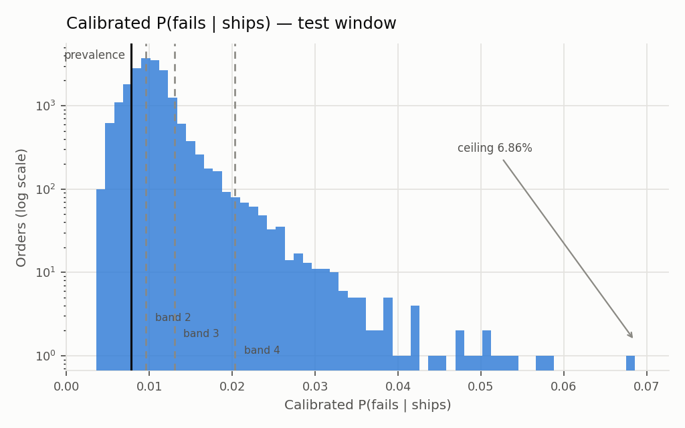
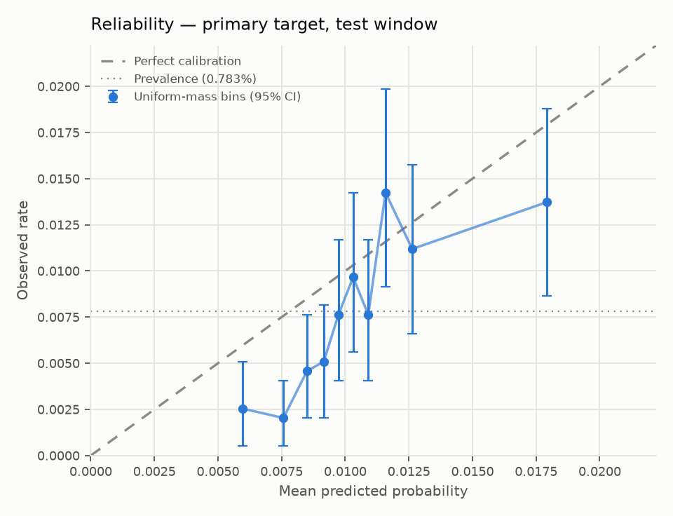
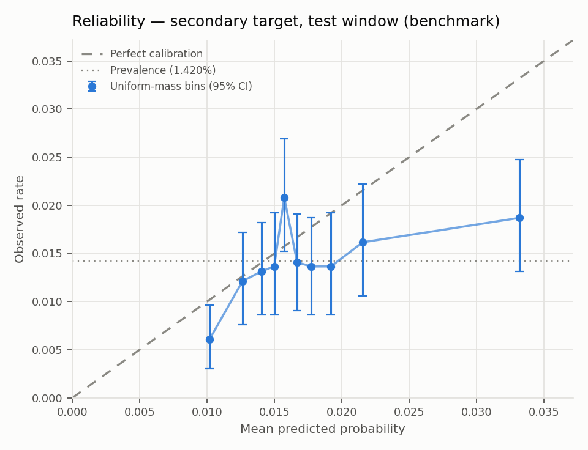

# Calibration — Step 4

Generated by `scripts/07_calibrate.py`. **No cost model.** ARCHITECTURE.md §6.

- Generated (UTC): `2026-09-05 21:01:33`
- Calibrator: Platt, A = `-0.703441`, B = `1.477981`, fit on the last **30 days** of validation
- Fit population: 7,380 orders, 71 positives

## 1. The achievable probability range

Stated first, because Step 5's per-order thresholds must live inside it. **A policy layer built against a threshold this model cannot reach is inert.**

| | Calibrated P(fails \| ships) |
|---|---:|
| Minimum | 0.36150% |
| Median | 1.00149% |
| 90th percentile | 1.3540% |
| 99th percentile | 2.3795% |
| **Maximum** | **6.8559%** |
| Test prevalence | 0.7832% |

**The model never emits a probability above 6.856%.** The top decile spans 1.3540% to 6.8559%.

Any Elkan threshold p\* above 6.856% selects nothing and any threshold below 0.36150% selects everything, so the entire useful range of the cost model is bounded by these two numbers. That is a hard constraint on §7, not a presentational note: with c_FP and c_FN as §7.1 specifies, p\* = c_FP/(c_FP + c_FN), so a threshold inside this range requires c_FN to exceed c_FP by roughly 14× or more. If the assumed costs do not satisfy that, the policy never fires and the honest report is that the detector cannot support the intervention at those costs.

## 2. Window comparison - Brier across {30, 60, 90}

Section 6 says to select the window length "by Brier score on the validation window". Taken literally that instruction is **structurally biased**, and the bias is worth stating before the numbers.

### Why "Brier on the validation window" cannot be taken literally

Validation is 90 days, so **the 90-day candidate *is* the whole validation window.** Scoring every candidate on that window evaluates each calibrator against a population whose base rate is, by construction, the 90-day candidate's own base rate. The longest window is evaluated at home.

Cross-fitting removes the *in-sample* advantage - every row gets an out-of-fold prediction - but it cannot remove the **base-rate alignment**, which is exactly the part that matters for a calibration map whose intercept absorbs the base rate.

So the selection is made on an **evaluation slice**: the most recent 30 days of validation. It is identical for every candidate, so it favours none a priori; it is the part of validation adjacent to test; and its base rate is the closest available proxy for the deployment base rate. Every candidate is scored there with out-of-fold predictions.

| Evaluation set | n | Base rate | vs test |
|---|---:|---:|---:|
| Whole validation window (= the 90d candidate) | 21,329 | 1.435% | 1.83x |
| **Evaluation slice - last 30d** | 7,380 | 0.962% | 1.23x |
| Test window (not used for selection) | 19,662 | 0.783% | 1.00x |

### Results

| Window | Orders | Positives | Prevalence | **Brier on slice** | Brier on whole validation |
|---:|---:|---:|---:|---:|---:|
| 30d **<--** | 7,380 | 71 | 0.962% | **0.0095359** | 0.0141342 |
| 60d | 14,148 | 173 | 1.223% | **0.0095436** | 0.0141118 |
| 90d | 21,329 | 306 | 1.435% | **0.0095617** | 0.0141051 |

**The two columns disagree.** On the evaluation slice the best candidate is **30d**; on the whole validation window it is **90d**. That disagreement is the bias made visible: the whole-window column ranks the candidates in order of length, which is what an evaluation set aligned to the longest candidate produces.

### Is the gap distinguishable?

Brier is a mean of per-row squared errors, so the difference between two candidates is a paired mean difference on identical rows and can be bootstrapped directly. Selecting on the fifth decimal of a scalar without this check would be reading noise. 4,000 resamples on the evaluation slice, against the 30-day candidate:

| Comparison | delta-Brier vs 30d | 95% CI | Resolves |
|---|---:|---|---|
| 60d - 30d | +0.0000077 | [-0.0000206, +0.0000331] | no |
| 90d - 30d | +0.0000259 | [-0.0000161, +0.0000618] | no |

**No gap excludes zero.** Brier does not distinguish the candidates even on the corrected evaluation set - every difference sits inside sampling noise. A proper scoring rule that cannot separate the options has not made a selection, so its point estimate is a tie-break at best, and the pre-registered prevalence-drift argument carries the decision.

**Best on the slice: 30 days — and this is a comparison, not a selection.**

The margin does not support the word 'selection'. The 30d/60d gap is 0.0000077 against a 95% CI roughly seven times wider that straddles zero. The three candidates are statistically indistinguishable, and the winner is decided by an amount this data cannot resolve. A selection whose outcome the data cannot resolve is a comparison, and calling it a selection would overstate what was measured.

**`CALIBRATION_WINDOW_DAYS = 30` is a fixed choice**, hardcoded in `scripts/08_policy.py`, `scripts/09_reasons.py`, `scripts/11_fairness.py`, `api/service.py` and `scripts/90_capture_tier1_lock.py`. Nothing downstream reads this table. The comparison exists to show that the choice is **not load-bearing** - that the system would report materially the same thing at 60 or 90 days - rather than to make the choice.

The fix did not change this conclusion; it changed whether the conclusion was reliable. Pre-fix the same table selected 60d on one run in three: `_time_folds` did not tile its index range, and the unassigned slots held uninitialised memory that occasionally dominated a Brier mean. See `tests/test_calibration_folds.py`.

The comparison **agrees with** the provisional choice in `eval/calibration_window.md`, which took 30 days on prevalence-drift grounds before any Brier number existed - though on a margin too small to be evidence for it.

Being precise about what was confirmed: the *literal* reading of section 6 - Brier on the whole validation window - would have selected 90d and overturned the pre-registration. The pre-registration was right, and right for the reason it gave: base-rate mismatch dominates the calibration map's intercept. What the measurement adds is that the selection *mechanism* section 6 specifies is itself sensitive to a base-rate artifact, which the pre-registration did not anticipate.

### After the fact: what test says

**Not an input to the selection above.** The window was chosen on validation alone; this reports what test shows afterwards, because a selection procedure that is never checked is not a procedure.

| Window | Brier on test | Top-decile predicted | Top-decile observed | Ratio |
|---:|---:|---:|---:|---:|
| 30d **<--** | 0.0077613 | 1.7924% | 1.3726% | 1.31x |
| 60d | 0.0077892 | 2.6431% | 1.3726% | 1.93x |
| 90d | 0.0078173 | 2.9264% | 1.3726% | 2.13x |

The selected window is best on test by both measures. Had the literal reading of section 6 been followed, 90d would have shipped - worse on test Brier and roughly twice as over-predicted in the decile where the system acts.

**This is a finding about section 6, not a result to celebrate.** The rule as written picks the wrong window on this panel, for a structural reason that recurs on any dataset where the calibration candidates are nested inside the evaluation window. The correction - evaluate on a fixed recent slice rather than the whole window - costs nothing and should be written back into section 6.

The prevalence figures the pre-registered argument turned on, restated so both sit on one page:

| Window | Prevalence | Ratio vs test |
|---:|---:|---:|
| 30d | 0.962% | 1.23x |
| 60d | 1.223% | 1.56x |
| 90d | 1.435% | 1.83x |
| **Test window** | **0.783%** | 1.00x |

## 3. Brier, before and after

| Scorer | Brier on test |
|---|---:|
| LightGBM's own probability (uncalibrated) | 0.0077886 |
| **Platt-calibrated** | **0.0077613** |
| Constant at validation prevalence | 0.0078135 |
| Constant at test prevalence (oracle) | 0.0077710 |

The raw score is not a probability, so its Brier is not meaningful as a calibration statement — it is shown to quantify what calibration is for, not as a competitor. The constant-at-prevalence rows are the reference points that matter: at 0.78% prevalence a model that predicts the base rate for everyone already achieves a very low Brier, so **Brier improvements here are small in absolute terms by construction** and the reliability curve carries more information than the scalar.

## 4. Reliability

Uniform-mass bins (equal count), not uniform width: at this prevalence equal-width bins put nearly every row in the first bin. Bootstrap percentile CIs on the observed rate, 2,000 resamples.

| Bin | n | Positives | Mean predicted | Observed | 95% CI |
|---:|---:|---:|---:|---:|---|
| 1 | 1,967 | 5 | 0.5975% | 0.2542% | [0.0508%, 0.5084%] |
| 2 | 1,966 | 4 | 0.7573% | 0.2035% | [0.0509%, 0.4069%] |
| 3 | 1,966 | 9 | 0.8496% | 0.4578% | [0.2035%, 0.7630%] |
| 4 | 1,966 | 10 | 0.9155% | 0.5086% | [0.2035%, 0.8138%] |
| 5 | 1,966 | 15 | 0.9732% | 0.7630% | [0.4069%, 1.1699%] |
| 6 | 1,966 | 19 | 1.0311% | 0.9664% | [0.5595%, 1.4242%] |
| 7 | 1,966 | 15 | 1.0904% | 0.7630% | [0.4069%, 1.1699%] |
| 8 | 1,966 | 28 | 1.1584% | 1.4242% | [0.9156%, 1.9837%] |
| 9 | 1,966 | 22 | 1.2631% | 1.1190% | [0.6612%, 1.5768%] |
| 10 | 1,967 | 27 | 1.7924% | 1.3726% | [0.8643%, 1.8810%] |

### smECE

**smECE = 0.002510** at bandwidth **σ = 0.005** on the probability scale (uncalibrated raw score, same bandwidth: 0.004901).

Bandwidth is stated as a parameter because a binned ECE can be driven toward zero by choosing enough bins; the smooth version replaces that choice with one explicit number. Formula and implementation in `models/calibration.py`.

## 5. Top-decile calibration — the headline number

§6: global ECE is dominated by the mass near zero, which is not where the system acts. The number that matters is calibration where the score is high enough to trigger anything.

| | Value |
|---|---:|
| Orders in top decile | 1,967 |
| Positives | 27 |
| **Mean predicted** | **1.7924%** |
| **Observed** | **1.3726%** |
| Calibration gap (predicted − observed) | 0.4197% |
| Ratio | 1.31× |

**The top decile is over-predicted by 0.4197%.** This is the prevalence drift arriving exactly where it was predicted to: the calibrator was fit on a window whose base rate is above the test window's, and Platt's intercept carries that forward.

## 6. Tier-conditional calibration — provisional bands

**These are not policy tiers.** They are quantile cuts on calibrated probability, used because §6's tier-conditional table needs a grouping and the decision rule that will define the real tiers is Step 5. They are deliberately **not** named `allow` / `confirm` / `prepaid-only` / `defer`: those are outputs of a per-order expected-cost comparison, not bands of a score, and naming them now would pre-commit the policy layer to a shape it has not earned.

Cut points — quantiles 50%, 90%, 99% of calibrated probability on the **validation** window:

| Band | Range of calibrated P |
|---|---|
| Band 1 | < 0.9607% |
| Band 2 | 0.9607% – 1.3023% |
| Band 3 | 1.3023% – 2.0331% |
| Band 4 | ≥ 2.0331% |

Cut points are fixed on validation and applied unchanged to test, so the test band populations are free to be uneven — and their unevenness is itself a distribution-shift signal.

| Band | n | Positives | Mean predicted | Observed | Gap | Ratio |
|---|---:|---:|---:|---:|---:|---:|
| Band 1 | 8,414 | 34 | 0.7912% | 0.4041% | 0.3872% | 1.96× |
| Band 2 | 8,835 | 86 | 1.1013% | 0.9734% | 0.1279% | 1.13× |
| Band 3 | 2,014 | 27 | 1.5248% | 1.3406% | 0.1842% | 1.14× |
| Band 4 | 399 | 7 | 2.6223% | 1.7544% | 0.8679% | 1.49× |

This table is the headline §6 asks for, and it should be read with the band populations in view: a band holding a handful of positives cannot support a calibration claim, and the CIs in §4 are the honest width for those cells.

## 7. Secondary target — benchmark only

`label_a` on the item-joined matured population (the leak-corrected population from `eval/model_report.md` §5), same calibrator recipe, same 30-day window.

| | Value |
|---|---:|
| Test rows / positives | 19,789 / 281 |
| Test prevalence | 1.4200% |
| Platt A / B | -0.712418 / 1.462849 |
| Brier, calibrated | 0.0140624 |
| smECE (σ = 0.005) | 0.003060 |
| Max calibrated P | 35.4415% |

Reported as a benchmark and not substituted for the primary: different estimand, different population.

## 8. Assertions

| Check | Result |
|---|---|
| Calibrator never sees test | **PASS** — fit indices come from the validation split only |
| Fit population = early-stopping population = validation window | **PASS** |
| Validation ∩ test = ∅ | **PASS** — disjoint `order_id` sets, and max(validation ts) < min(test ts) |
| Calibrated output monotone in raw score | **PASS** |

Platt is monotone by construction, so the monotonicity check is a wiring test, not a modelling one: a failure would mean the score vector and the probability vector had been misaligned somewhere, not that the calibrator misbehaved.

Determinism — calibrator artifact, calibrated predictions, report and figures are byte-identical across runs; the optimiser starts from a fixed point and the bootstrap uses a fixed seed.

