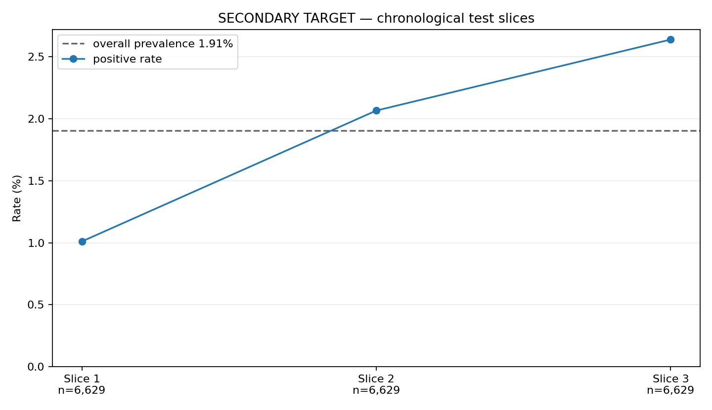

# Drift slices — SECONDARY TARGET

Generated UTC: `2026-09-04 23:01:22`

**This is the SECONDARY target (`label_a`) benchmark, not the primary `label_b` target. The result does not transfer to the primary.**

The chronological test window is split into three equal slices. The operating point is the global top 5% of calibrated secondary scores (`995` orders), held fixed across slices. Overall test prevalence is **1.91%** (379 positives of 19,887).

| Slice | Boundary | n | Positives | Positive rate | Treated | Precision | Recall |
|---:|---|---:|---:|---:|---:|---:|---:|
| 1 | 2018-05-24 to 2018-06-28 | 6,629 | 67 | 1.01% | 267 | 3.75% | 14.93% |
| 2 | 2018-06-28 to 2018-07-31 | 6,629 | 137 | 2.07% | 335 | 8.06% | 19.71% |
| 3 | 2018-07-31 to 2018-09-17 | 6,629 | 175 | 2.64% | 393 | 19.34% | 43.43% |

The slice size is approximately 126 positives per slice. **Any apparent difference is within noise at n≈126 per slice; drift is not resolvable at this slice size.** This is a secondary benchmark result only and must not be used to claim primary-target drift or primary-target retraining need.
