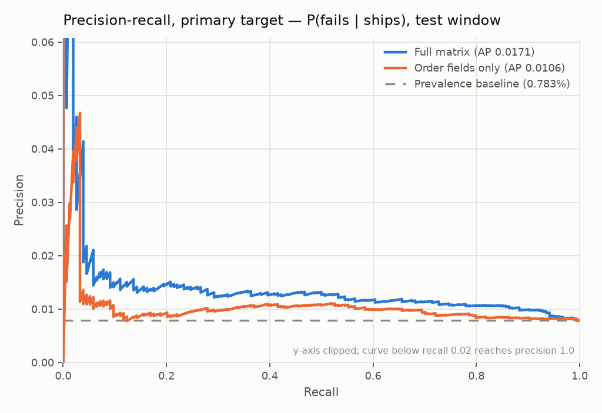
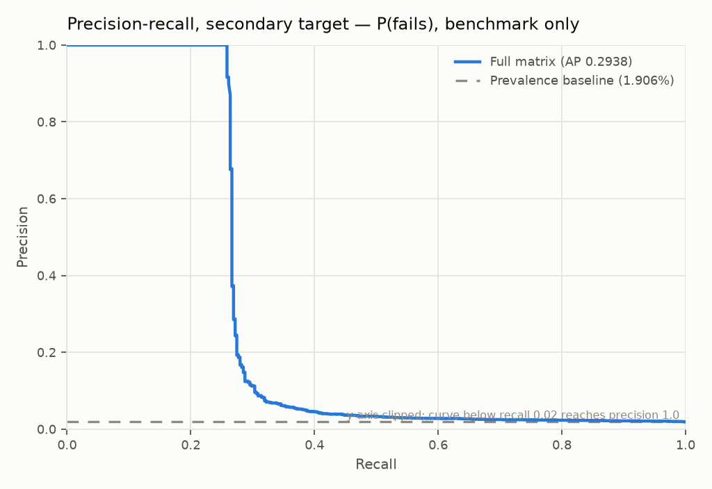
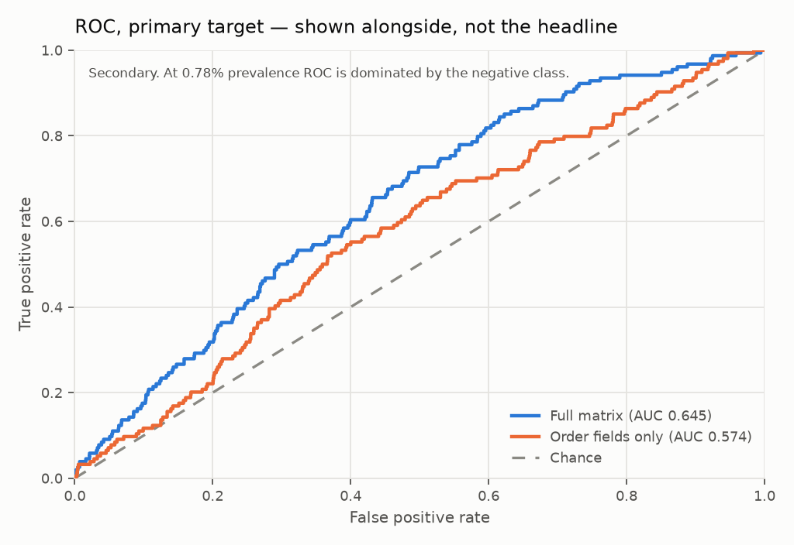

# Model report — Step 3

Generated by `scripts/04_train_model.py`. **No calibration layer.** The booster's output is a score, not a probability; the Platt map is Step 4 and does not exist yet. Nothing here should be read as a calibrated risk.

- Generated (UTC): `2026-09-04 15:59:04`
- Model sha256 (primary): `8e3a350744db1e42a73868a3a661b58a174150df37a280ff3031987dc051e1ef`

## Sample size and what it can resolve

Printed first, ahead of any metric, per ARCHITECTURE.md §9 item 1.

| | PRIMARY | SECONDARY |
|---|---:|---:|
| Test rows | 19,662 | 19,887 |
| **Test positives** | **154** | **379** |
| Test prevalence | **0.783%** | 1.906% |
| **Minimum detectable AP difference** | **0.043** | 0.027 |

Any AP difference below **0.043** on the primary target is reported as "not resolvable at this sample size" — not as a win, and not rerun on the secondary target until it resolves.

## 1. Primary target — P(fails | ships)

`label_b` on the risk set. Natural class distribution, no resampling.

| Metric | Value |
|---|---:|
| **Average precision** | **0.0171** |
| Prevalence baseline | 0.0078 |
| AP − baseline | **+0.0093** |
| Lift over baseline | 2.19× |
| ROC-AUC *(not the headline)* | 0.6450 |
| Boosting rounds (early-stopped) | 50 of 2000 |

### The gap is below the planning MDD — which is not a test, and `eval/significance.md` resolves it

AP is 0.0171 against a prevalence baseline of 0.0078 — a gap of **+0.0093**, against a minimum detectable difference of **0.043** at 154 test positives.

**Do not read that as "the model cannot be shown to beat the base rate".** This section once did, and it was wrong — wrong in the conservative direction, which is still wrong. The MDD is a *planning* figure computed before seeing data under an assumed AP and an assumed correlation; comparing two realised point estimates against it discards the pairing, assumes rho rather than measuring it, and treats the prevalence baseline as a fixed constant when its AP moves with the resample.

**`eval/significance.md` runs the test this comparison is standing in for, and the model separates.** The paired bootstrap on the AP difference gives a 95% CI that excludes zero, and the permutation null against random ranking gives p = 0.00060. Section 6 there explains why the planning figure was roughly 3.5x too pessimistic here: it assumed AP around 0.10 against a realised 0.017, and the standard error of average precision scales with sqrt(AP(1-AP)).

What this section does support: the ranking is better than chance by every point estimate here — 2.19× lift, ROC-AUC 0.645 — and nothing was tuned to make it so. Tuning against the test set until a gap clears a threshold would manufacture the number rather than measure it. The MDD is retained above as the planning figure it is, and never as a decision rule.

### Operating point

**Provisional.** The per-order Elkan threshold is Step 5 and does not exist, so the operating point here is a stated intervention budget: treat the top 5% of scores.

| | Predicted negative | Predicted positive |
|---|---:|---:|
| **Actual negative** | 18,538 | 970 |
| **Actual positive** | 140 | 14 |

Precision **1.42%**, recall **9.09%** at score threshold `0.023044`.

### Precision@k and recall@k at the intervention budget

| Budget | Orders treated | True positives | Precision | Recall | Lift |
|---|---:|---:|---:|---:|---:|
| top 1% | 197 | 6 | 3.05% | 3.90% | 3.89× |
| top 5% | 984 | 14 | 1.42% | 9.09% | 1.82× |

## 2. What the encodings bought — order-fields-only baseline

Same split, same parameters, same early stopping. The only difference is the feature set: order fields alone, with no customer history, no pincode encoding, and no availability flags.

Availability is excluded from the baseline deliberately — `n_missing_features` is computed across the customer-history columns, so it carries history-presence information and belongs on the encodings side of the comparison.

| Model | Features | AP | ROC-AUC | Rounds |
|---|---:|---:|---:|---:|
| Full matrix | 34 | **0.0171** | 0.6450 | 50 |
| Order fields only | 20 | 0.0106 | 0.5742 | 138 |
| **Difference** | | **+0.0066** | +0.0708 | |

**Not resolvable.** The gap of +0.0066 AP is inside the 0.043 minimum detectable difference, so this comparison does not establish that the history and pincode encodings help — or that they do not. Given customer history is empty for 97% of rows, a small or absent contribution is the expected outcome rather than a surprise; what this test size cannot do is separate 'small' from 'zero'. This row feeds §9's ablation section as an unresolved comparison.

## 3. Feature importance

Gain and split counts from the primary model. Included so the 97%-empty customer history block is **visible rather than asserted** — a feature that never splits is doing nothing, and that shows up here directly.

| # | Feature | Gain | Gain share | Splits | Monotone |
|---:|---|---:|---:|---:|---:|
| 1 | `product_category` | 1,156.9 | 16.47% | 122 |  |
| 2 | `pincode_failure_rate_smoothed` | 759.8 | 10.81% | 73 | +1 |
| 3 | `order_freight` | 608.3 | 8.66% | 115 |  |
| 4 | `product_volume_cm3` | 476.2 | 6.78% | 94 |  |
| 5 | `purchase_hour` | 472.7 | 6.73% | 79 |  |
| 6 | `product_weight_g` | 456.4 | 6.50% | 82 |  |
| 7 | `pincode_prior_orders` | 454.8 | 6.47% | 71 |  |
| 8 | `freight_ratio` | 338.3 | 4.81% | 70 |  |
| 9 | `cust_prior_failure_rate` | 306.7 | 4.37% | 60 |  |
| 10 | `purchase_month` | 258.1 | 3.67% | 49 |  |
| 11 | `purchase_dow` | 256.2 | 3.65% | 49 |  |
| 12 | `payment_value` | 253.3 | 3.61% | 52 |  |
| 13 | `global_prior_failure_rate` | 240.1 | 3.42% | 57 |  |
| 14 | `order_value` | 228.7 | 3.25% | 47 |  |
| 15 | `n_items` | 186.6 | 2.66% | 30 |  |
| 16 | `product_photos_qty` | 151.2 | 2.15% | 35 |  |
| 17 | `avg_item_price` | 132.3 | 1.88% | 35 |  |
| 18 | `payment_installments` | 77.2 | 1.10% | 22 |  |
| 19 | `log_order_value` | 66.3 | 0.94% | 15 |  |
| 20 | `pincode_prior_failures` | 60.9 | 0.87% | 10 |  |
| 21 | `n_sellers` | 40.1 | 0.57% | 9 |  |
| 22 | `is_boleto` | 24.0 | 0.34% | 6 |  |
| 23 | `purchase_is_weekend` | 18.6 | 0.26% | 4 |  |
| 24 | `n_missing_features` | 1.0 | 0.01% | 1 |  |
| 25 | `cust_prior_avg_value` | 0.9 | 0.01% | 1 |  |
| 26 | `cust_days_since_prior_order` | 0.0 | 0.00% | 0 |  |
| 27 | `cust_prior_boleto_ratio` | 0.0 | 0.00% | 0 | +1 |
| 28 | `cust_prior_failures` | 0.0 | 0.00% | 0 | +1 |
| 29 | `cust_prior_orders` | 0.0 | 0.00% | 0 |  |
| 30 | `has_item_rows` | 0.0 | 0.00% | 0 |  |
| 31 | `has_payment_row` | 0.0 | 0.00% | 0 |  |
| 32 | `has_product_metadata` | 0.0 | 0.00% | 0 |  |
| 33 | `n_payment_types` | 0.0 | 0.00% | 0 |  |
| 34 | `n_products` | 0.0 | 0.00% | 0 |  |

**9 of 34 features never produced a split.**

- `cust_days_since_prior_order`
- `cust_prior_boleto_ratio`
- `cust_prior_failures`
- `cust_prior_orders`
- `has_item_rows`
- `has_payment_row`
- `has_product_metadata`
- `n_payment_types`
- `n_products`

4 of them are customer-history features. That is the 97% null rate from `eval/feature_report.md` §4 showing up as model behaviour rather than as a claim: the booster found nothing to split on because for almost every row there is no history to split.

## 4. Monotonic constraints

Loaded from `models.constraints.MONOTONE_CONSTRAINTS`, a named module constant, and applied as a vector whose length is asserted equal to the feature count.

| Feature | Constraint | Spec (§5.3) |
|---|---:|---|
| `pincode_failure_rate_smoothed` | +1 | direct |
| `cust_prior_failures` | +1 | direct |
| `cust_prior_boleto_ratio` | +1 | **inverted** — see below |

**`cust_prior_boleto_ratio` is inverted relative to §5.3.** spec constrains prepaid_ratio (-1); this matrix carries the boleto ratio, its complement (prepaid = 1 - boleto), so the constraint is +1. A sign error here would be worse than no constraint: the model would be forced to learn a backwards relationship and the SHAP reason strings would confidently tell a merchant the opposite of the truth — which is the failure mode §5.3 exists to prevent. Asserted in `tests/test_model.py`.

**`component_size` omitted.** network/ring group is not built for Olist (ARCHITECTURE.md 4.2 - no device identifiers or phone numbers in the data).

Constraint vector length 34 = feature count 34.

## 5. Secondary target — P(fails), benchmark only

`label_a` on all matured orders. Reported as a benchmark and **never substituted for the primary**. A result here does not transfer: it is a different estimand on a different population.

| Metric | Value |
|---|---:|
| Test rows / positives | 19,887 / 379 |
| Prevalence baseline | 0.0191 |
| **Average precision** | **0.2938** |
| AP − baseline | +0.2748 |
| Lift over baseline | 15.42× |
| ROC-AUC *(not the headline)* | 0.6649 |
| Minimum detectable AP difference | 0.027 |

| Budget | Orders treated | True positives | Precision | Recall | Lift |
|---|---:|---:|---:|---:|---:|
| top 1% | 199 | 101 | 50.75% | 26.65% | 26.63× |
| top 5% | 995 | 113 | 11.36% | 29.82% | 5.96× |

### That number is inflated by a post-outcome join artifact

**Do not read 0.2938 as the secondary target's performance.** It is the first number in this repo that looked good, and it looked good for the wrong reason.

767 matured orders have **no rows in `olist_order_items_dataset.csv`**, and **767 of them (100.0%) are `label_a` positives**. In the test window that is 98 orders, all positive — **25.9% of the secondary target's 379 test positives, identified perfectly by a single artifact.**

The absence is a *consequence* of the outcome, not a checkout-time state. An order that resolves to `unavailable` has no item rows in the export; at the moment of checkout the customer had items in the cart and those rows would exist. So `has_item_rows` — and the null pattern across `n_items`, `order_value`, `n_sellers`, `n_products`, and `n_missing_features` — encodes the label.

This is leakage the column whitelist could not catch. Every column involved is on the whitelist and knowable at checkout; what leaks is the **join cardinality**, which no name-based or perturbation check inspects. Worth stating plainly: the guardrails in this repo are real and they did not catch this.

**Corrected benchmark**, restricted to orders that join to items:

| | Leaked | Corrected |
|---|---:|---:|
| Test rows | 19,887 | 19,789 |
| Test positives | 379 | 281 |
| Prevalence | 1.906% | 1.420% |
| **Average precision** | 0.2938 | **0.0190** |
| AP − baseline | +0.2748 | **+0.0048** |
| Lift | 15.42× | 1.34× |
| Precision@1% | 50.75% | 2.53% |

**Corrected, the secondary target no longer clears its threshold** — +0.0048 against 0.027. The apparent result was the artifact.

**The primary target is unaffected.** The risk set contains 1 order without item rows, because an order that reached a carrier had items. That is why the primary's 0.0171 and the secondary's 0.2938 differ by so much — and the gap was the signal that something was wrong, not evidence that the broader label is easier.

Carried forward: `has_item_rows` is **not a usable feature on Olist** and the availability group needs the join-cardinality caveat recorded against it in `data/COLUMN_WHITELIST.md` before any of this reaches a trained model that ships.

## 6. ROC — shown alongside, explicitly not the headline

ROC-AUC is 0.6450 on the primary target. At 0.783% prevalence the curve is dominated by the 19,508 negatives, so it looks respectable whether or not the model is useful at any budget a merchant would actually run. It is here because omitting it invites the question, and precision-recall is the metric §9 reports.

## 7. Reproducibility

Asserted by refitting the primary model in the same process and comparing:

| Check | Result |
|---|---|
| Model artifact byte-identical | **PASS** |
| Test predictions byte-identical | **PASS** |

`deterministic=true`, `force_row_wise=true`, seed `42`, threads pinned to `4`. The thread count is pinned because LightGBM's determinism guarantee holds for the same data *and the same thread count*; leaving it to the machine's core count would make the artifact irreproducible across machines.

`has_zip_prefix` is dropped from the trained matrix: it is constant on this panel, cannot produce a split, and its presence in a feature list overstates the contract. It remains in the feature contract labelled a no-op, per the §4.2 rule.

### Column-order contract

The trained column order is recorded in `artifacts/models/*/contract.json`, and `predict()` requires an exact match. A frame with the right columns in the wrong order is **rejected, not reordered** — LightGBM addresses features positionally and so do the monotone constraints, so scoring a permuted frame would apply the pincode constraint to whatever feature now sits at that index, silently.

