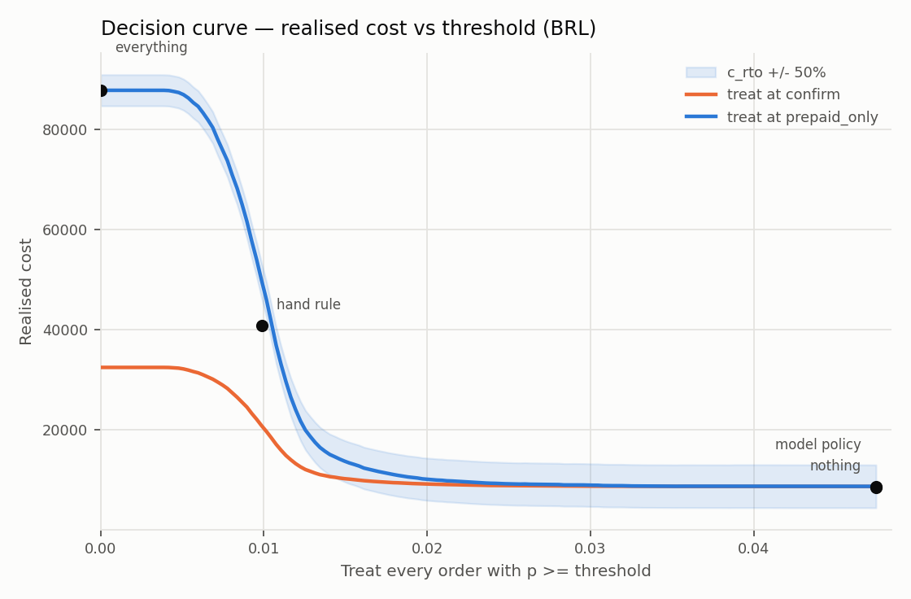

# Policy layer — Step 5

Generated by `scripts/08_policy.py`. ARCHITECTURE.md §7. **No SHAP, no API.**

- Generated (UTC): `2026-09-05 21:01:46`
- Population: risk set, test window — 19,662 orders, 154 positives, prevalence 0.783%
- Calibrated by the 30-day Platt map from `eval/calibration.md`

## 0. Currency

**Every figure in this document is in BRL (Brazilian reais.)**

Olist is a Brazilian panel: `price` and `freight_value` are BRL. The track is Indian and ARCHITECTURE.md writes costs in rupees. **This repo does not convert.** Putting a rupee sign on Brazilian magnitudes would make every number in the cost table wrong by whatever the exchange rate happens to be — invisible on a slide, obvious in a spreadsheet, and corrosive to every honest-metrics claim made elsewhere in this repo.

A reference rate of **15.5 INR per BRL** is recorded in `policy/constants.py` as an `ASSUMPTION` and is **deliberately not applied**. It is there so a reader can do the arithmetic themselves and see exactly what it would cost them.

## 1. Feasibility — stated first

The calibrated model never emits a probability above **6.856%** (`eval/calibration.md` §1). Elkan's rule is p\* = c_FP / (c_FP + c_FN), so for any order to clear any threshold the cost ratio must satisfy

    c_FN / c_FP  >=  (1 - p_max) / p_max  =  13.59

| Tier | Median p\* | Min p\* | Median c_FN/c_FP | Orders where p ≥ p\* | Orders assigned |
|---|---:|---:|---:|---:|---:|
| `confirm` | 7.404% | 0.395% | 12.51 | 13 | 12 |
| `prepaid_only` | 16.030% | 0.843% | 5.24 | 22 | 22 |
| `defer` | 31.659% | 3.710% | 2.16 | 0 | 0 |
| `allow` | — | — | — | — | 19,628 |

**34 of 19,662 orders (0.173%) receive any action at the stated assumptions.** `defer` never fires.

**Every tier's median threshold sits above the ceiling.** For the median order no tier is worth firing at any risk this model can express.

The orders that fire are those whose individual cost ratio is unusually favourable — high freight relative to margin, so a return costs a lot and annoying the customer costs little.

### This is what the per-order cost model buys

§7.1 argues that treating `c_rto`, `c_conv` and `c_friction` as scalars is wrong. That argument is testable here, and the test is decisive:

| Cost model | Threshold | Orders treated |
|---|---|---:|
| Flat — `confirm` at median costs | 6.944% (single value) | 0 |
| Flat — `prepaid_only` at median costs | 18.400% (single value) | 0 |
| Flat — `defer` at median costs | 32.161% (single value) | 0 |
| **Flat — total** | | **0** |
| **Nested — per-order p\*** | varies per order | **34** |

**A flat cost model treats nothing at all.** Its single threshold sits above the ceiling for every tier, so the policy is completely inert. The nested model finds 34 orders where the individual economics work — on this panel that is the difference between a policy that exists and one that does not.

§7.1's claim is that per-order costs turn the optimal threshold from a constant into a function. The gap between these two rows is that claim measured.

### What would have to be true for more to fire

Not a tuning exercise — the assumptions are **not** adjusted to force firing. This states the gap so a reader can judge it against their own numbers:

- **`confirm`** — median ratio 12.51 against 13.59 required. The tier fires for the median order if c_FN rises or c_FP falls by a factor of **1.09×**.
- **`prepaid_only`** — median ratio 5.24 against 13.59 required. The tier fires for the median order if c_FN rises or c_FP falls by a factor of **2.59×**.
- **`defer`** — median ratio 2.16 against 13.59 required. The tier fires for the median order if c_FN rises or c_FP falls by a factor of **6.29×**.

An inert policy correctly reported is a result. A policy tuned until it fires is not, and the cost constants in `policy/constants.py` were set before this table was computed.

## 2. Decision curve — the headline

§7.6: **do not lead with a currency figure.** Every term in the cost model is an assumption applied to Brazilian orders; a single number presented as the headline invites a reader to discover mid-slide that it was assumed. The curve is the honest object — the rupee-equivalent figure is one point inside it, at one stated assumption set.

Realised cost on the test window against a single global treat-above threshold, in BRL. The shaded band is `c_rto` ±50%. The four policies of §7.6 are marked.

The curve is close to flat over most of its range, and that is the finding: with a ceiling of 6.86% and a treated population of 34 orders, the policy cannot move total cost far in either direction. A steep curve would mean the threshold choice mattered; a flat one means the detector is not yet strong enough for the threshold choice to be the interesting question.

## 3. Four-row policy cost table

Realised cost on the test window, BRL, with percentile bootstrap CIs (2,000 resamples over test rows).

| Policy | Orders treated | Cost (BRL) | 95% CI | vs doing nothing |
|---|---:|---:|---|---:|
| Intervene on nothing | 0 | 8,613.13 | [7,029.29, 10,546.50] | — |
| Intervene on everything (prepaid-only) | 19,662 | 87,881.68 | [85,781.02, 90,166.87] | +79,268.55 |
| Hand rule: value > 268.24 AND new customer | 1,872 | 40,839.15 | [38,489.62, 43,429.66] | +32,226.02 |
| Model + per-order cost policy | 34 | 8,467.61 | [7,023.71, 10,186.94] | -145.52 |

**Intervening on everything costs 87,881.68 against 8,613.13 for doing nothing — 10.2× worse.** That row is the track's own bar: it is the concrete demonstration that false positives cost real money. At 0.78% prevalence, treating all 19,662 orders pays the conditional abandonment cost on 19,508 good orders to influence 154 bad ones.

The model policy costs 8,467.61, a saving of 145.52 against doing nothing (1.689%).

The marginal intervals above overlap almost completely, and taken alone they would say nothing resolves. **They are the wrong comparison.** Total cost is dominated by which expensive orders happened to fail, and that variance is shared by every policy evaluated on identical rows. The model policy differs from doing nothing on 34 orders out of 19,662; resampling the *difference* cancels the shared part, exactly as the paired bootstrap did for average precision in `eval/significance.md`.

| Policy vs doing nothing | Orders differing | Delta cost (BRL) | 95% CI on the difference | P(worse than nothing) |
|---|---:|---:|---|---:|
| Intervene on everything | 19,662 | +79,268.55 | [+77,405.68, +81,224.97] | 1.0000 |
| Hand rule | 1,872 | +32,226.02 | [+30,374.47, +34,159.86] | 1.0000 |
| Model + cost policy | 34 | -145.52 | [-595.77, +34.83] | 0.2605 |

**The model policy's saving does not resolve.** The paired CI is [-595.77, +34.83], which includes zero: the point estimate of -145.52 is inside sampling noise, and the policy was worse than doing nothing in 26.05% of resamples. At 34 orders where the policy does anything at all there is not enough intervention happening to demonstrate a saving, whatever the point estimate says.

The two loss-making policies are not close calls: both are worse than doing nothing with the entire interval above zero.

### The hand-written rule, built for real

`order_value > 268.24 BRL AND customer has no prior order` — the 90% value quantile of the training split.

| | Value |
|---|---:|
| Orders flagged | 1,872 (9.52%) |
| Positives caught | 15 of 154 |
| Precision | 0.801% |
| **ROC-AUC** | **0.5011** |
| Cost | 40,839.15 |
| vs doing nothing | +32,226.02 |

**ROC-AUC 0.5011** — barely distinguishable from random, which is what the reference paper found for its own business rule (0.562). On this panel the rule is close to "value > X" alone, because 97% of customers have no prior order, so the second clause removes almost nothing.

**The hand rule costs more than doing nothing** (40,839.15 against 8,613.13). This is the most persuasive argument available for why a model is warranted: the rule a merchant would actually write, implemented faithfully, loses money.

## 4. Predicted vs realised cost

§9 item 11, and distinct from the sensitivity sweep below. The sweep asks how much the answer moves when the assumptions move. This asks a different question: **the policy predicts a cost before acting — what was it actually?** Systematic divergence is the signature of a mis-specified effectiveness prior.

| Effectiveness scale | Orders treated | Predicted cost | Realised cost | Gap |
|---:|---:|---:|---:|---:|
| ×0.5 | 3 | 12,211.27 | 8,618.72 | -3,592.55 |
| ×1.0 | 34 | 12,201.22 | 8,467.61 | -3,733.61 |
| ×1.5 | 144 | 12,157.33 | 8,514.42 | -3,642.91 |

The gap is dominated by the difference between the calibrated probability and the realised outcome on 19,662 orders, not by the effectiveness prior — with 34 orders treated, the intervention barely enters the total. **The priors are not tuned to close this gap**, per §9.

## 5. Sensitivity

Both axes §7.6 asks for: `c_rto` ±50%, and the effectiveness matrix swept.

| c_rto | Effectiveness | Orders treated | Cost (BRL) | Doing nothing | Saving |
|---:|---:|---:|---:|---:|---:|
| ×0.5 | ×0.5 | 0 | 4,306.56 | 4,306.56 | +0.00 |
| ×0.5 | ×1.0 | 3 | 4,312.16 | 4,306.56 | -5.59 |
| ×0.5 | ×1.5 | 11 | 4,316.21 | 4,306.56 | -9.65 |
| ×1.0 | ×0.5 | 3 | 8,618.72 | 8,613.13 | -5.59 |
| ×1.0 | ×1.0 | 34 | 8,467.61 | 8,613.13 | +145.52 |
| ×1.0 | ×1.5 | 144 | 8,514.42 | 8,613.13 | +98.71 |
| ×1.5 | ×0.5 | 11 | 12,929.34 | 12,919.69 | -9.65 |
| ×1.5 | ×1.0 | 144 | 12,820.99 | 12,919.69 | +98.71 |
| ×1.5 | ×1.5 | 629 | 13,218.54 | 12,919.69 | -298.84 |

**The two axes are not separately identifiable.** Treated counts are symmetric across the diagonal - x0.5/x1.0 and x1.0/x0.5 both treat 3 orders, x1.0/x1.5 and x1.5/x1.0 both treat 144 - because c_FN = e * c_rto - impression, so the policy responds to the *product* of the two scales and barely to either alone. The impression term is the only thing breaking the symmetry, and it is small.

That governs how the sweep should be read: halving the assumed cost of a return and halving the assumed effectiveness are the same intervention as far as this policy is concerned. Nine cells give five distinct behaviours, and no amount of sweeping separates the two assumptions. Telling them apart needs a randomised rollout, which section 7.7 says outright is not identifiable offline.

**More treatment is not better.** At x1.5/x1.5 the policy treats 629 orders and the saving turns negative - it costs more than doing nothing. The optimum is interior, and a policy tuned to spend its whole intervention budget would walk straight past it.

## 6. Action ladder and intervention rates

`allow → confirm → prepaid_only → defer` (§7.5). **Nobody is blocked.** The worst outcome for a false positive is being asked to pay upfront — a materially different fairness profile from a system that refuses service, and a design choice claimed explicitly.

These replace the provisional Bands 1–4 from `eval/calibration.md` §6, which were quantile cuts on score and were labelled provisional pending exactly this.

| Tier | Orders | Intervention rate | Positives | Precision | Mean p |
|---|---:|---:|---:|---:|---:|
| `allow` | 19,628 | 99.827% | 152 | 0.77% | 1.041% |
| `confirm` | 12 | 0.061% | 1 | 8.33% | 1.414% |
| `prepaid_only` | 22 | 0.112% | 1 | 4.55% | 2.489% |
| `defer` | 0 | 0.000% | — | — | — |

### Reason buckets

Buckets are the dominant feature group by **summed positive SHAP attribution** (Step 6) - how much each group actually pushed the score up. This replaced the pre-SHAP standardised-deviation stand-in, which disagreed on 47% of orders and produced a different treated set; the comparison is in `eval/reasons.md` section 7.

| Reason bucket | Orders | Positives | Prevalence | Treated |
|---|---:|---:|---:|---:|
| `order_composition` | 17,594 | 128 | 0.728% | 18 |
| `pincode` | 2,052 | 26 | 1.267% | 16 |
| `customer_history` | 16 | 0 | 0.000% | 0 |
| `availability` | 0 | — | — | — |

`customer_history` is dominant for only 16 orders, which is the 97% empty history showing up again — the bucket exists in the contract and is nearly unreachable on this panel.

## 7. Every assumed constant

Each constant that enters a cost, with its basis tag. Only two rows are OBSERVED; everything else is assumed, and one is an outright guess.

| Constant | Value | Unit | Basis | Rationale |
|---|---:|---|---|---|
| `order_value` | — | BRL | OBSERVED | sum of olist_order_items.price for the order |
| `forward_freight` | — | BRL | OBSERVED | sum of olist_order_items.freight_value; the outbound leg actually charged |
| `reverse_shipping_multiple` | 1 | x forward freight | ASSUMPTION | the return leg is priced as the outbound leg. Reverse logistics is often dearer per parcel than forward, so this is the conservative end |
| `handling_cost` | 8 | BRL per RTO | ASSUMPTION | receiving, inspecting and restocking a returned parcel; a fixed per-parcel charge independent of order value |
| `inventory_holding_rate_daily` | 0.0005 | fraction of value per day | ASSUMPTION | ~18% annualised carrying cost, the standard planning figure for working capital plus warehousing |
| `rto_blocked_days` | 20 | days | ASSUMPTION | round-trip time during which the unit is neither sold nor sellable: outbound transit, failed delivery attempts, return transit, restock |
| `margin_rate` | 0.2 | fraction of order value | ASSUMPTION | contribution margin on a marketplace order. Enters every conversion-loss term, so the whole friction side scales with it |
| `message_cost` | 0.3 | BRL per message | ASSUMPTION | one WhatsApp/SMS send. Paid on every treated order regardless of response |
| `fatigue_allowance` | 0.5 | BRL per message | **GUESS** | brand annoyance and the unsubscribe analogue. There is no measurement behind this number and none is available offline. It is included because setting it to zero asserts that messaging customers is free, which is false, and the sensitivity sweep is the honest treatment of it |
| `manual_review_cost` | 3 | BRL per order | ASSUMPTION | analyst time to hold and inspect a deferred order. Impression cost of the defer tier - paid whether or not the order is released |
| `p_dropoff_at_confirm` | 0.02 | probability | ASSUMPTION | a good customer who cancels because they were asked to confirm. Triggered: paid only when it happens |
| `p_abandon_if_cod_removed` | 0.15 | probability | ASSUMPTION | cash-on-delivery is a payment preference, not only a payment method; removing it loses a real share of otherwise-good orders. The dominant term in the prepaid-only tier, whose impression cost is ~0 |
| `p_abandon_if_deferred` | 0.25 | probability | ASSUMPTION | holding an order for review costs more conversions than a confirmation prompt |
| `ltv_multiplier_per_prior_order` | 0.15 | x friction per prior order | ASSUMPTION | friction applied to a loyal customer costs future orders, not just this one (section 7.1). Multiplier is 1 + 0.15 x prior orders, capped |
| `ltv_multiplier_cap` | 2 | x | ASSUMPTION | ceiling on the LTV multiplier so a single high-frequency customer cannot dominate the cost table |
| `brl_to_inr_reference` | 15.5 | INR per BRL | ASSUMPTION | NOT APPLIED. Approximate mid-market rate, 2025. Recorded so a reader can convert the tables themselves; every number in this repo stays in BRL |

**`fatigue_allowance` is a guess, labelled as one.** brand annoyance and the unsubscribe analogue. There is no measurement behind this number and none is available offline. It is included because setting it to zero asserts that messaging customers is free, which is false, and the sensitivity sweep is the honest treatment of it.

### Effectiveness matrix — every cell an assumption

| Reason | `confirm` | `prepaid_only` | `defer` |
|---|---:|---:|---:|
| `order_composition` | 0.35 | 0.25 | 0.40 |
| `pincode` | 0.15 | 0.45 | 0.50 |
| `customer_history` | 0.10 | 0.60 | 0.65 |
| `availability` | 0.20 | 0.30 | 0.35 |

The *structure* — that effectiveness varies by why the order is risky — is defensible and is §7.3's central correction. The *values* are not measured and cannot be measured offline: the counterfactual does not exist in observational data. They are swept in §5 rather than presented as known.

## 8. Assertions

| Check | Result |
|---|---|
| Population is the risk set, not the matured set | **PASS** |
| Row-for-row with Step 4's calibrated output | **PASS** — 19,662 rows |
| The 767-order item-join artifact absent | **PASS** — 0 order(s) without item rows in the test population |
| Thresholds computed without labels | **PASS** — `policy/elkan.py` takes no label argument; there is nothing to pass |
| Every assumed constant tagged and reported | **PASS** — 16 constants in §7 |
| Determinism across runs | **PASS** |

The label-independence assertion is structural rather than procedural. `apply_policy` and every threshold function take costs and a calibrated probability; no label enters. `expected_cost_at_threshold` does take `y`, and is an evaluation function that is never called while choosing a threshold.

