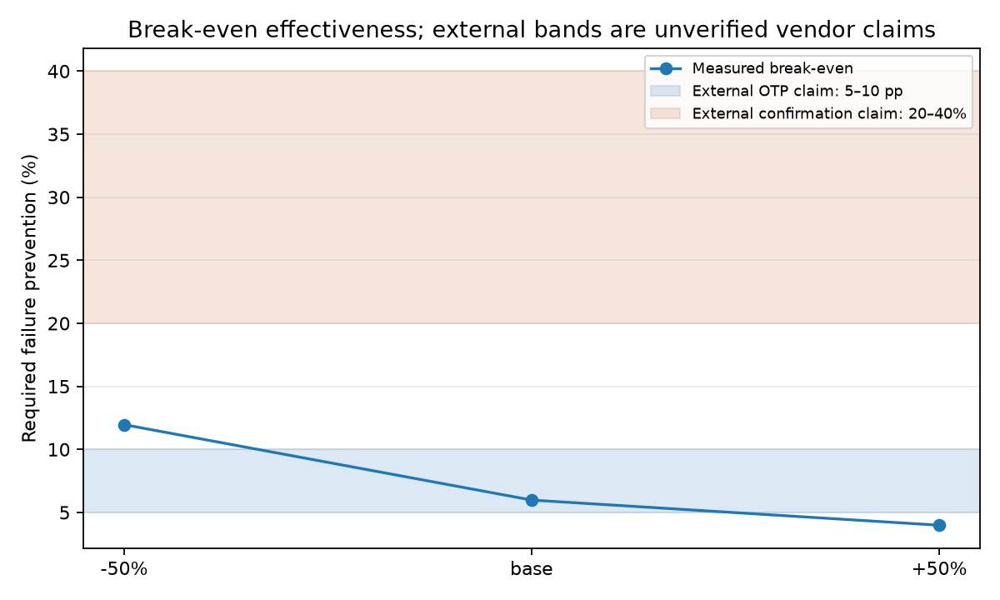

# Break-even effectiveness

Generated by `responder/breakeven.py` from observed outcomes in the primary Tier-1 test window.
No effectiveness prior enters the calculation.

| `c_rto` sweep | Required effectiveness |
|---:|---:|
| -50% | 11.9602% |
| base | 5.98008% |
| +50% | 3.98672% |

The band is compared with external, unverified vendor claims only: OTP or WhatsApp pre-dispatch confirmation (30–40% RTO reduction), IVR verification (20–30%), OTP alone (5–10 percentage points on overall RTO), and part-pay COD fees (60–70% of impulse orders). These anchors are not inputs to the arithmetic.

