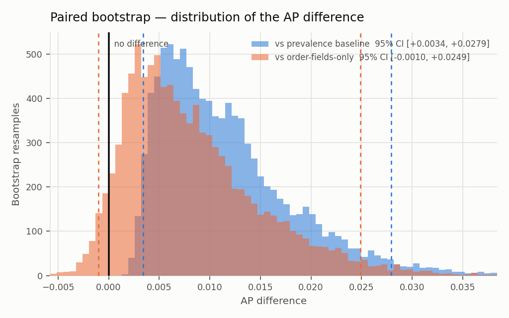

# Significance — resolving the Step 3 null

Generated by `scripts/05_significance.py`. Supersedes the MDD comparison in `eval/model_report.md` §1 and §2.

- Generated (UTC): `2026-09-05 20:12:13`
- Paired bootstrap: **10,000** resamples, seed `20260901`, identical test rows for every model
- Test window: 19,662 rows, 154 positives, prevalence 0.783%

## 1. Why this supersedes the MDD comparison

Step 3 reported the model as unresolved because its AP sat +0.0093 above the prevalence baseline against a minimum detectable difference of 0.043. **That was not a test.** The MDD is a *planning* figure: it answers "before seeing data, how large a gap would I need?" under an assumed AP and an assumed correlation ρ between two models.

Comparing two realised point estimates against it is strictly weaker than testing the difference, for three reasons:

1. **It discards the pairing.** Both models are scored on the *same* test rows, so they share every source of variance arising from which orders landed in the test window. Resampling the difference cancels that shared variance; comparing two independent point estimates does not.
2. **It assumes ρ rather than measuring it.** The MDD was quoted at ρ = 0.8. The bootstrap needs no such assumption — the correlation is whatever it is, and it is absorbed automatically.
3. **The prevalence baseline is not an independent model.** Its AP *is* the prevalence of the sample, so it moves with the resample's positive count. Pairing captures that; an MDD comparison treats it as a fixed constant.

The MDD remains reported below as the planning figure it was. It is not the answer.

## 2. Against chance — permutation null

Reported first, because it is the comparison the prevalence baseline only approximates.

A *randomly ranked* model does not score the prevalence — it scores slightly above it. Average precision averages precision-at-rank over the positives, and precision-at-rank is upward-biased at the small ranks where a positive can land early by luck. So "beats the prevalence baseline" is a marginally easier bar than "beats chance", and at 154 positives the gap is worth measuring rather than assuming away.

Null: 10,000 random rankings of the actual test labels.

| | Value |
|---|---:|
| Prevalence (textbook PR baseline) | 0.007832 |
| **Mean AP of a random ranker** | **0.008314** |
| Upward bias the prevalence line misses | **+0.000482** |
| Null 95th / 99th percentile | 0.010025 / 0.012626 |
| **Observed model AP** | **0.017136** |
| **Permutation p-value** | **0.00060** |

**The model beats chance.** Its average precision of 0.0171 sits above the 99th percentile of the random-ranking null (0.0126), p = 0.00060. This is the stronger statement: not merely above the idealised prevalence line, but above what random ordering of these exact labels actually produces.

The bias is +0.000482 — about 5% of the observed margin over prevalence, so it does not change the conclusion here. It is measured rather than assumed because at a smaller positive count it would.

### How much does the baseline choice matter?

Measured, not asserted. Under a pure-noise scorer a correctly calibrated 5% test should reject 5% of the time. Over 200 independent noise draws (n = 4,000, prevalence 2%):

| Procedure | Rejection rate under the null | Nominal |
|---|---:|---:|
| Paired bootstrap vs **prevalence baseline** | **0.145** | 0.05 |
| **Permutation null** (random ranking) | **0.055** | 0.05 |

The permutation null is calibrated. The prevalence-baseline comparison rejects **2.9x as often as it should**, and the null mean sat above the prevalence in **100% of draws** — the bias is structural, not sampling noise.

So §3's bootstrap-against-prevalence result should be read as the weaker of the two, and the permutation p-value above is the one that carries the claim. Here they agree and the margin is not close (p = 0.00060, observed 0.0171 against a null 99th percentile of 0.0126), so the conclusion does not depend on which is used.

*This came out of the repo's own test suite: a deliberately random scorer "separated" from the prevalence baseline in the paired bootstrap. That is a property of the baseline rather than a bug in the bootstrap, and it is pinned in `tests/test_significance.py` as a calibration comparison.*

## 3. Paired bootstrap on the AP difference

| Comparison | Observed Δ | Bootstrap mean | 95% CI | P(Δ ≤ 0) | Verdict |
|---|---:|---:|---|---:|---|
| model − prevalence baseline | +0.0093 | +0.0116 | [+0.0034, +0.0279] | 0.0000 | **separates** |
| full matrix − order-fields-only | +0.0066 | +0.0083 | [-0.0010, +0.0249] | 0.0520 | **does not separate** |

Difference distribution, percentiles:

| Comparison | p1 | p5 | p25 | p50 | p75 | p95 | p99 |
|---|---:|---:|---:|---:|---:|---:|---:|
| model − prevalence baseline | +0.0030 | +0.0039 | +0.0066 | +0.0102 | +0.0149 | +0.0246 | +0.0324 |
| full matrix − order-fields-only | -0.0021 | -0.0001 | +0.0033 | +0.0068 | +0.0117 | +0.0216 | +0.0289 |

## 4. DeLong test on ROC-AUC

Ranking quality and probability quality come apart (ARCHITECTURE.md §9), so the ranking may resolve where average precision does not. Both outcomes are reported.

| Model | ROC-AUC | 95% CI | z vs 0.5 | p | Excludes 0.5 |
|---|---:|---|---:|---:|---|
| Full matrix | 0.6450 | [0.6050, 0.6850] | 7.11 | 1.183e-12 | **yes** |
| Order fields only | 0.5742 | [0.5303, 0.6181] | 3.31 | 9.238e-04 | **yes** |

DeLong's midrank estimator is exact under ties, which matters here: a gradient-boosted model assigns identical scores to every row landing in the same combination of leaves.

## 5. What the tests support

### The model separates. The Step 3 "unresolved" call was too conservative.

The paired 95% CI on the AP difference against the prevalence baseline is **[+0.0034, +0.0279]**, which **excludes zero**. The difference was ≤ 0 in 0.0000 of 10,000 resamples. The permutation null in §2 agrees and is the stronger test: p = 0.00060 against random ranking.

**Correction to `eval/model_report.md` §1.** That section reports the model as not demonstrably beating the prevalence baseline. That conclusion was reached by comparing a point estimate (+0.0093) against a planning heuristic (0.043) rather than by testing the difference. The paired test — which is the procedure §9 specifies and is strictly more powerful — resolves it. **The model does separate from the prevalence baseline on the primary target.**

The earlier statement was honest about its uncertainty but wrong about the conclusion, and it was wrong in the conservative direction: it under-claimed. Recorded here rather than by editing §1, so the reasoning that produced the over-cautious call stays visible.

**The encodings remain unresolved.** The full matrix leads the order-only baseline by +0.0066 AP, 95% CI [-0.0010, +0.0249], which includes zero. This test size cannot separate a small contribution from none.

**Ranking resolves.** ROC-AUC 0.6450, 95% CI [0.6050, 0.6850], p = 1.18e-12. The model orders orders better than chance, and that conclusion is independent of the average-precision result above — exactly the targeting-vs-prediction split §9 warns about.

### What this does not license

Separation from a prevalence baseline is a low bar and is **not** a claim that the model is useful. At the top-5% budget precision is 1.42% and recall 9.09%: the policy layer in §7 decides whether that clears the cost of intervening, and that layer does not exist yet. Nor does calibration — these are scores, not probabilities, and every number here is about *ranking*.

Nothing was tuned on these results.

## 6. The MDD, reported as the planning figure it is

| | Value |
|---|---:|
| Planning MDD (AP 0.10, ρ 0.8, α 0.05, power 0.80) | 0.043 |
| Observed Δ vs prevalence | +0.0093 |
| Paired bootstrap 95% CI half-width | 0.0123 |

The realised half-width is **0.0123**, against a planning MDD of **0.043** — the planning figure was **3.5× too pessimistic** for this comparison. The approximation assumed AP ≈ 0.10; the realised AP is ~0.02, and the standard error of average precision scales with √(AP(1−AP)), so assuming an AP five times too high inflated the required gap correspondingly. The planning figure did its job — it stopped us promising resolution we could not deliver — but it should not have been used as a test, and this section is the correction.

**Carried forward:** comparisons in §9 are adjudicated by the paired bootstrap, not by the MDD. The MDD is quoted once, as a planning figure, and never as a decision rule.

