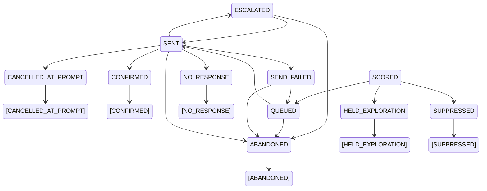

```mermaid
stateDiagram-v2
    ABANDONED --> [ABANDONED]
    CANCELLED_AT_PROMPT --> [CANCELLED_AT_PROMPT]
    CONFIRMED --> [CONFIRMED]
    ESCALATED --> ABANDONED
    ESCALATED --> SENT
    HELD_EXPLORATION --> [HELD_EXPLORATION]
    NO_RESPONSE --> [NO_RESPONSE]
    QUEUED --> ABANDONED
    QUEUED --> SENT
    SCORED --> HELD_EXPLORATION
    SCORED --> QUEUED
    SCORED --> SUPPRESSED
    SEND_FAILED --> ABANDONED
    SEND_FAILED --> QUEUED
    SENT --> ABANDONED
    SENT --> CANCELLED_AT_PROMPT
    SENT --> CONFIRMED
    SENT --> ESCALATED
    SENT --> NO_RESPONSE
    SENT --> SEND_FAILED
    SUPPRESSED --> [SUPPRESSED]
```

Terminal states: ABANDONED, CANCELLED_AT_PROMPT, CONFIRMED, HELD_EXPLORATION, NO_RESPONSE, SUPPRESSED
